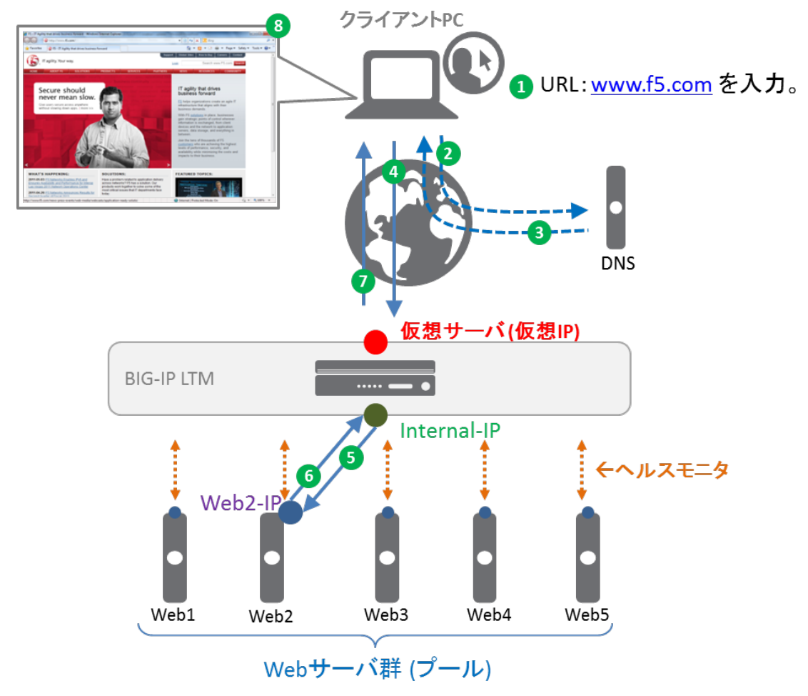

LTM動作概要
======================================

BIG-IP LTMはWebサーバ群に対して定期的なヘルスモニタリングにて稼動監視を行い、サーバ群へのロードバランシングや異常検知したサーバへの転送を止めたりなど、サーバシステム全体のパフォーマンス向上と可用性を高めることが出来るソリューションです。

LTMは以下のような流れで動作します。

1. クライアントがWebブラウザに、URL: www.f5.com を入力。
2. クライアントPCは、www.f5.com のIPアドレスを解決するために、DNSクエリを送信。
3. DNSサーバから www.f5.com のIPアドレスを得る。
4. Webブラウザは、そのIPアドレス (仮想サーバ)宛にHTTPリクエストを送信。
5. BIG-IP LTMは、Web サーバ群の中から1台 (この例ではWeb2)を選び、宛先アドレスを変換してHTTPリクエストを転送。
6. Webサーバ (Web2)は、そのHTTPリクエストに対するHTTPレスポンスを送信。
7. HTTPレスポンスを受けとったBIG-IP LTMは、送信元アドレス変換を行い、そのHTTPレスポンスをクライアントPCへ転送。
8. www.f5.com のWebページが表示される。

このように、インターネットユーザーからの膨大なリクエストを、サーバの状態をモニターしながら適切にサーバ群へリクエストを分散処理させることが可能です。
