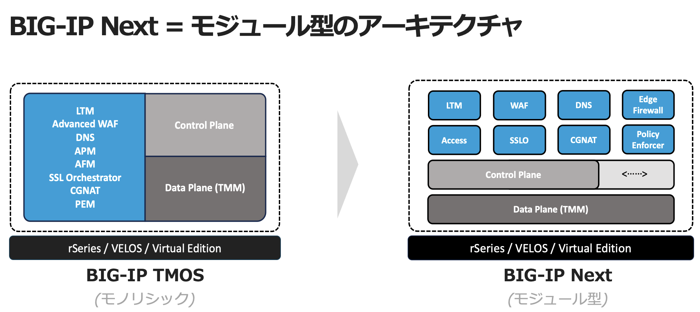
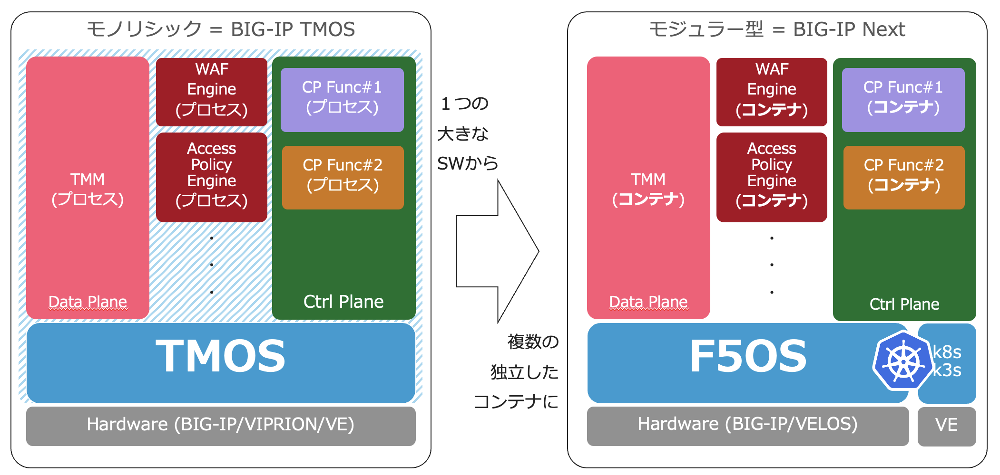

新しいBIG-IPソフトウェア"BIG-IP Next"とは？
======================================

F5は、2023年に、次世代アーキテクチャーを採用したソフトウェア”BIG-IP NEXT”（バージョンである20.0〜）をリリースしました。クラウドシフトやコンテナ、DevOpsなどのアプリケーションの変化に対応し最適な通信環境を提供するため、従来のTMOSをベースとし新しくコンテナ・マイクロサービスで動作するソフトウェアへと進化しました。これにより、コントロールプレーンとデータプレーンの分離、通信状況に応じた柔軟なスケールアウトの実現など、現在およびこれからのアプリケーション基盤に最適なネットワークやセキュリティを提供します。

|
|
次のイメージのように、TMOSではControl Plane、Data Planeそれぞれの機能モジュール全てを1つのソフトウェアとして提供していましたが、BIG-IP Nextでは、それらが複数のコンテナ群の集合として分離されています。

|
|
また次のイメージのように、アーキテクチャがコンテナに変わりますが、ハイレベルなアーキテクチャとしてはこれまでのBIG-IPのCoreであるTMMを踏襲しながらモジュラー型への進化を遂げています。

|
| **BIG-IPのCoreであるTMM は維持**

    - 今までと同様の機能を実装 (iRules等)

|
| **各機能 (プロセス)をコンテナで実装**

    - コントロールプレーンとデータプレーンの分離
    - 柔軟性、拡張性の向上
    - バージョンアップやマルチテナント管理が容易に
    - マシンリソース使用の最適化

