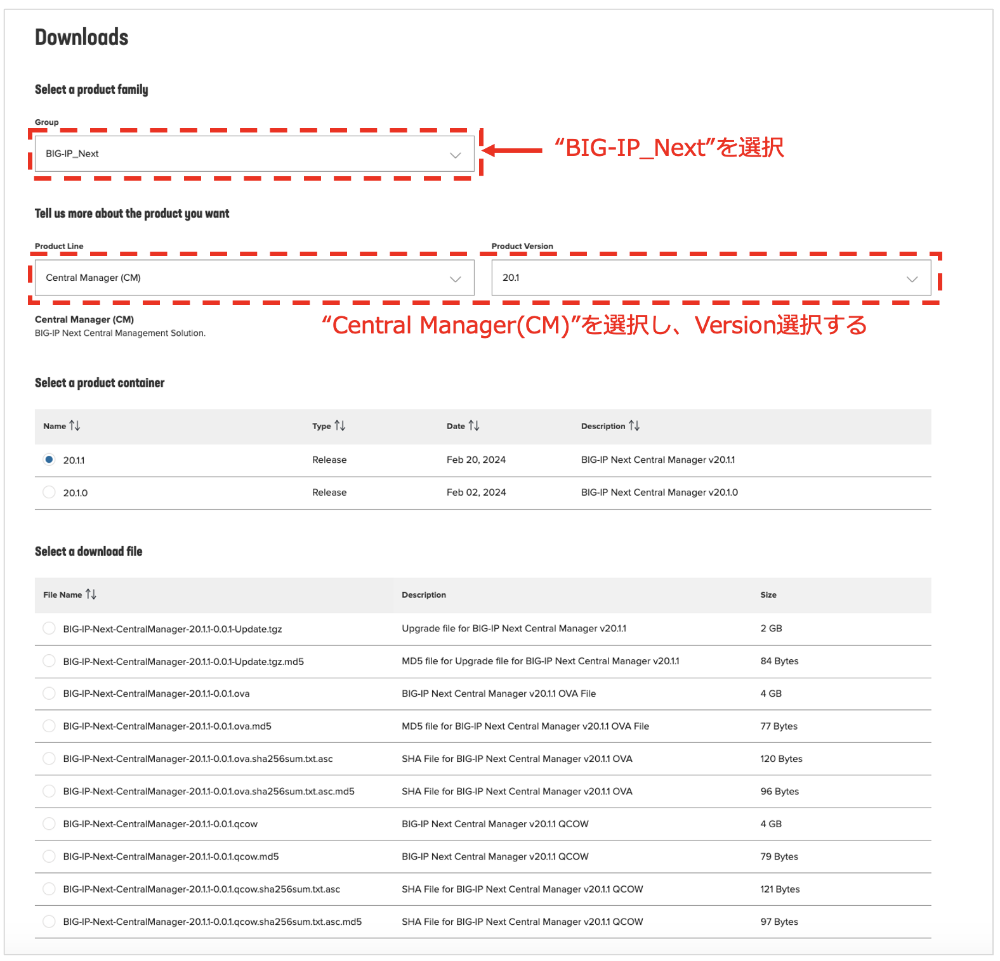

BIG-IP Next CMイメージの準備（参考）
======================================

.. note::
   本手順は、UDFハンズオンLabでは実施不要の参考情報として掲載しています。

BIG-IP Next CMサポート動作環境（v20.1時点）
--------------------------------------

- ハイパーバイザー: VMware vSphere version 7.x or KVM QEMU 6.2 on Ubuntu 22.04
- CPU: 8 vCPUs以上
- メモリ: 16GB以上
- ディスク容量: 350GB以上
- ネットワーク・インタフェース: 1

最新情報は以下サイトご参照ください。

- ESXi
   - https://clouddocs.f5.com/bigip-next/latest/install/cm_install_vmware.html
- KVM
   - https://clouddocs.f5.com/bigip-next/latest/install/cm_install_setup_mbip_kvm.html

|
CMイメージの入手
--------------------------------------

MyF5より入手します。

https://my.f5.com/

**RESOURCES >> Downloads**

