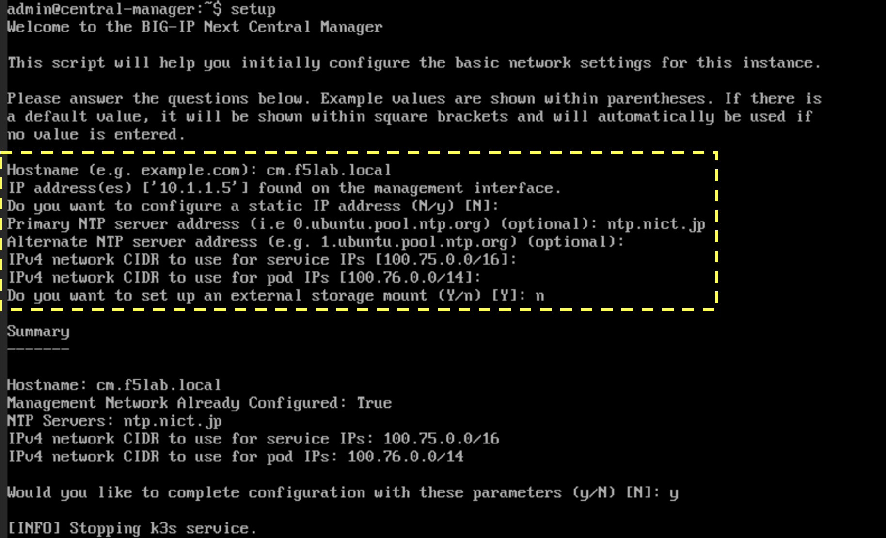

BIG-IP Next CMの初期セットアップ（参考）
======================================

.. note::
   この章は、ラボ構成上実施済みの手順となりますので参考情報としてください。

初期設定コマンドの実行
--------------------------------------

- **"setup"** コマンドを実行し、ホスト名、Mgmt IP、NTPサーバ等の設定を行います。

- Hostname:
   - **cm.f5lab.local**
- IP Address:
   - **設定済み**
- Primary NTP server address: 
   - **ntp.nict.jp**
- Do you want to set up an external storage mount: 
   - **n**
- 上記以外はDefaultのままEnter

- Summaryを確認してy(yes)でEnter

上記実行してから4,5分待つと以下プロンプトが返ってくるので
**"Y"**
を入力しEnter。

さらに7,8分待つと以下メッセージが表示され完了。

