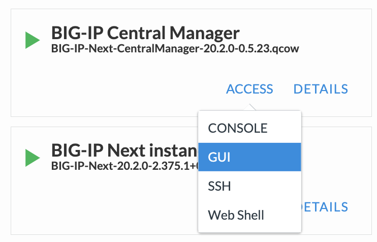
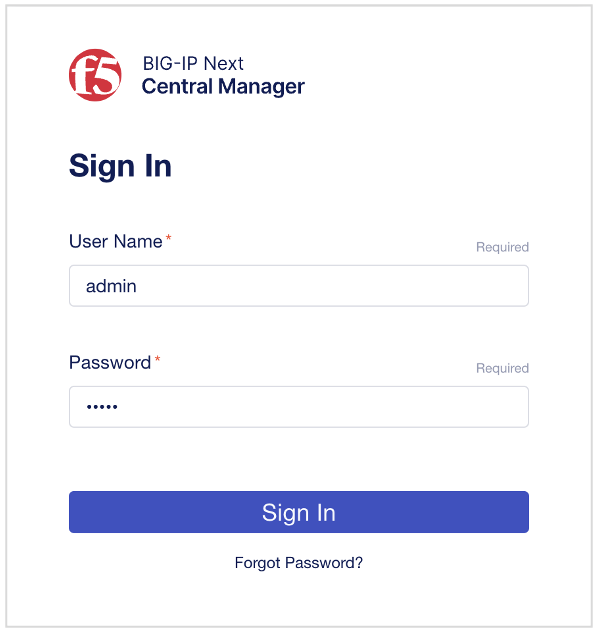
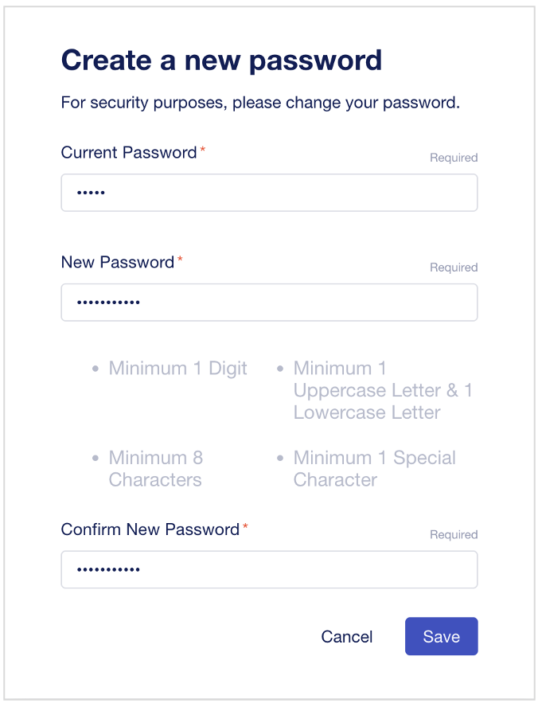
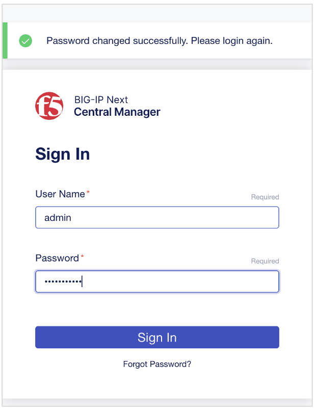
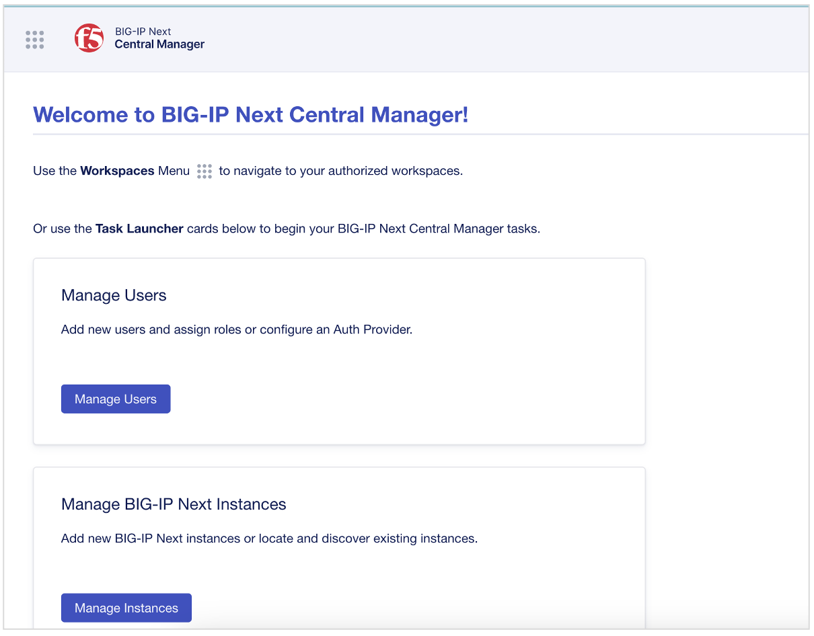

BIG-IP Next CMのGUIアクセス確認（参考）
======================================

.. note::
   この章は、ラボ構成上実施済みの手順となりますので参考情報としてください。

UDF環境からCM GUIへのアクセス方法
--------------------------------------

UDF画面上部タブの"DEPLOYMENT"をクリックし、BIG-IP Next Central Managerインスタンスの"ACCESS" > "GUI" を選択します。

UDF環境からCM GUIへのアクセス方法
--------------------------------------

サインイン画面が表示されたら、初期パスワードを入力します。

- 初期ユーザー名/パスワード:
   - **admin/admin**

|
初回はNew Password設定を求められるので設定します。

- "Current Password"の入力:
   - **admin**
- "New Password"の入力:
   - **Welcome123!**
  を新パスワードとして設定します。（任意のパスワードでOK）

|
パスワード設定完了すると、再度サインイン画面が表示されるので設定した新パスワードでログインします。

|
CMのHome画面が表示されていれば初期セットアップ完了です。

