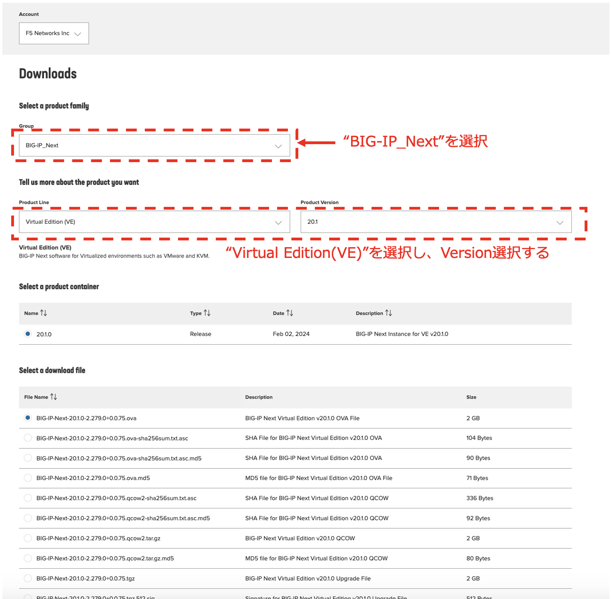

BIG-IP Nextインスタンス イメージの準備
======================================

.. note::
   本手順（4.1）は、UDFハンズオンLabではイメージ準備済みで実施不要のため、参考情報として掲載しています。ラボ演習は次の4.2から実施してください。

BIG-IP Next VEインスタンス サポート動作環境（v20.1時点）
--------------------------------------

- ハイパーバイザー: VMware vSphere version 7.x or KVM QEMU 6.2 on Ubuntu 22.04
- CPU/Memory:

  - 2 vCPUs/8GB RAM
  - 4 vCPUs/8GB RAM
  - 6 vCPUs/12GB RAM
  - 8 vCPUs/16GB RAM
  - 16 vCPUs/32GB RAM
  - 24 vCPUs/48GB RAM
- ディスク容量: 80GB以上

最新情報は以下サイトご参照ください。

- VMware vSphere
   - https://clouddocs.f5.com/bigip-next/latest/install/next_install_vmware_setup_script.html
- KVM
   - https://clouddocs.f5.com/bigip-next/latest/install/next_install_kvm_setup.html

.. note::
   Hardware PlatformのrSeries/Velos上での動作条件は別途ご確認ください。

|
イメージの入手
--------------------------------------

MyF5より入手します。
https://my.f5.com/

**RESOURCES >> Downloads**

