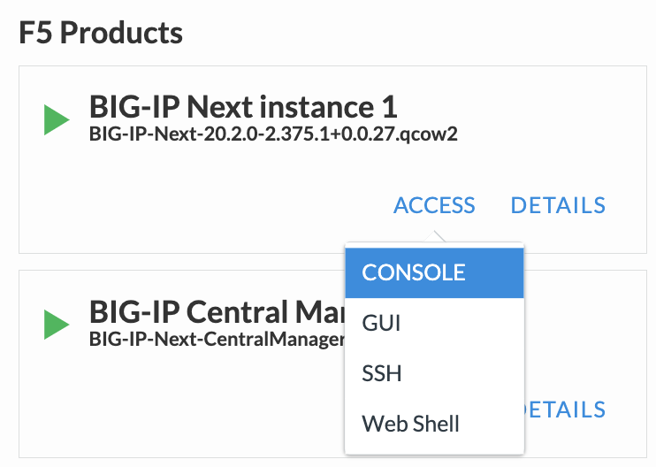
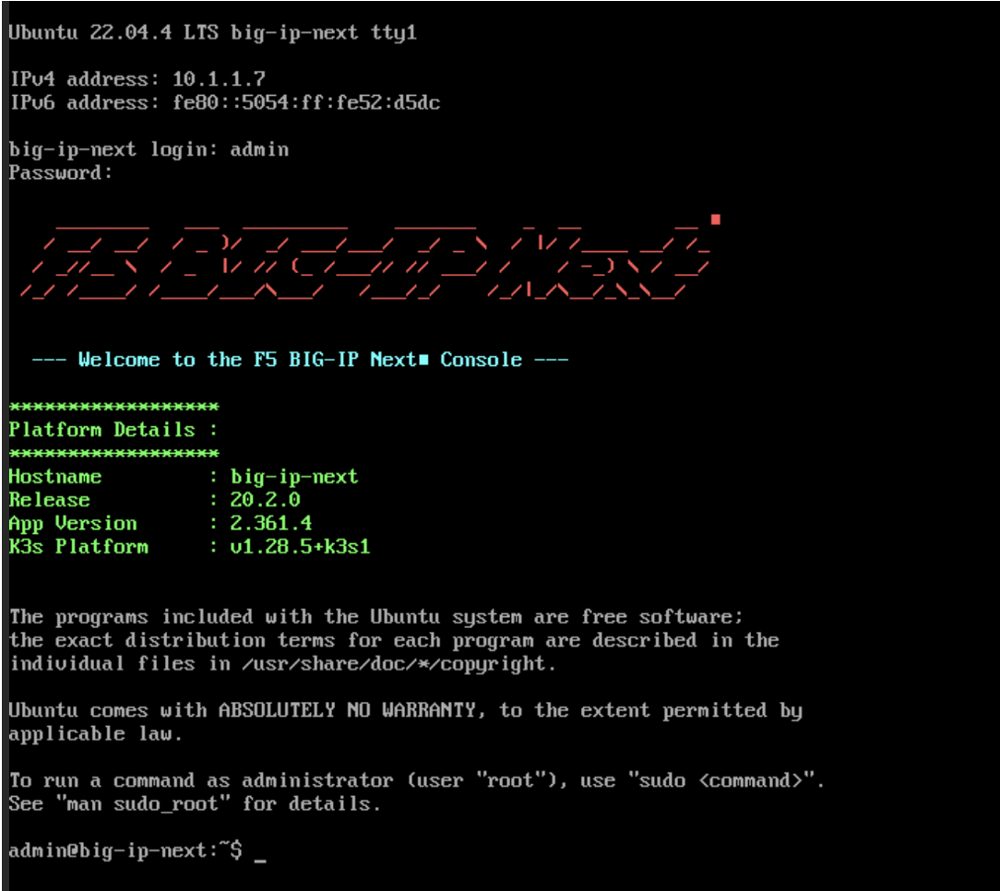

BIG-IP Nextインスタンスへのアクセス
======================================

UDF環境からNextインスタンス Consoleへのアクセス方法
--------------------------------------

UDF画面上部タブの"DEPLOYMENT"をクリックし、BIG-IP Next Instance1の"ACCESS" > "CONSOLE" を選択します。

BIG-IP Nextインスタンス CLIへのログイン
--------------------------------------

ログインプロンプトが表示されたら、初期パスワードを入力します。

- 初期ユーザー名/パスワード:
   - **admin/admin**

ログインすると、以下画面のようにロゴが表示されCLIにログインします。

