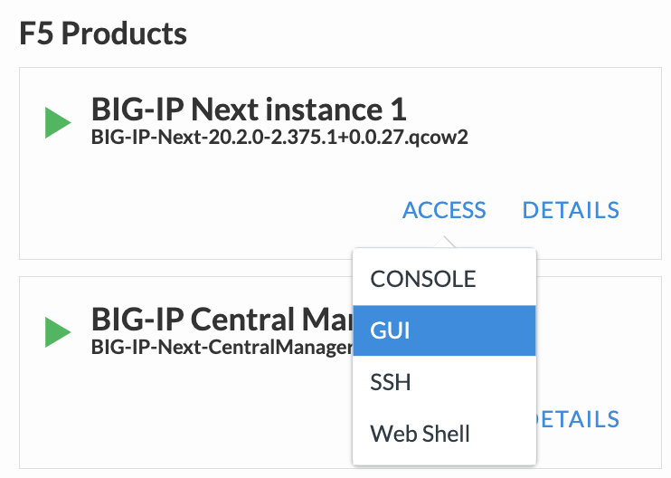
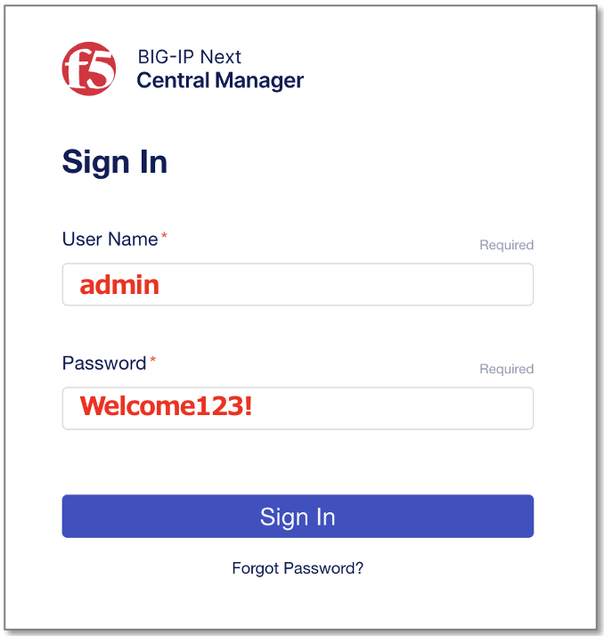
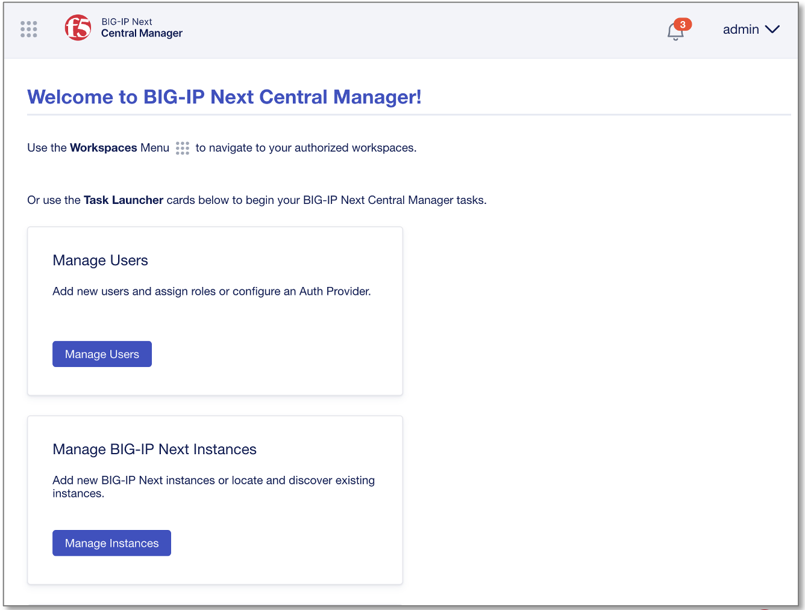
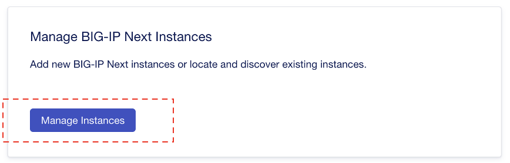
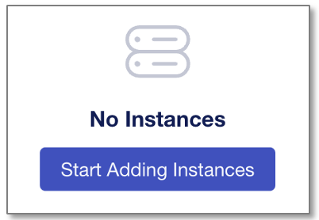
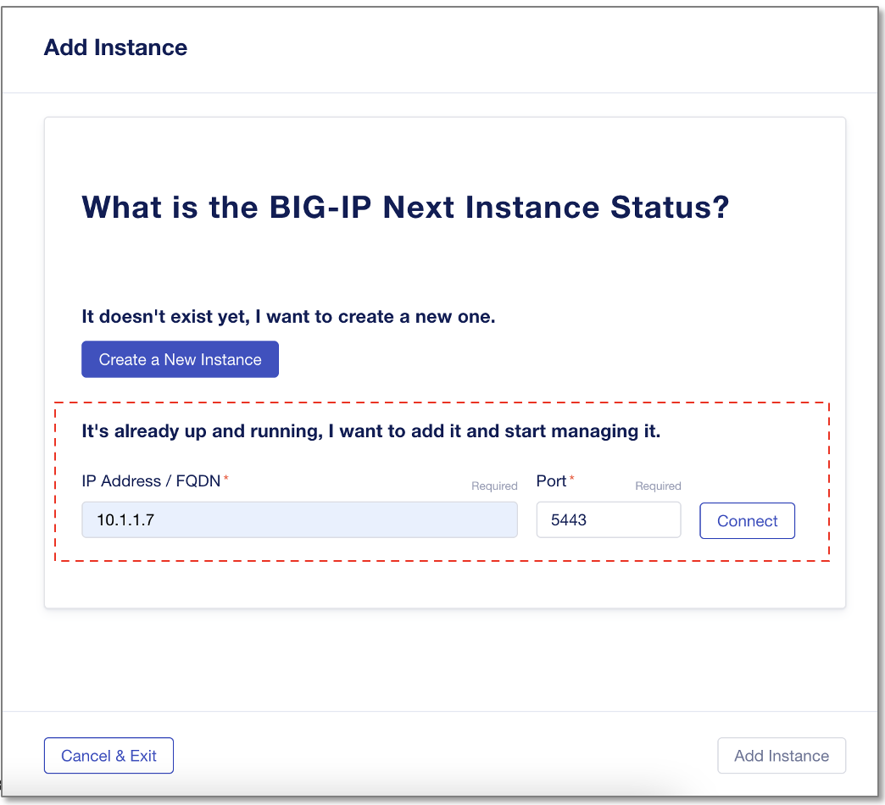
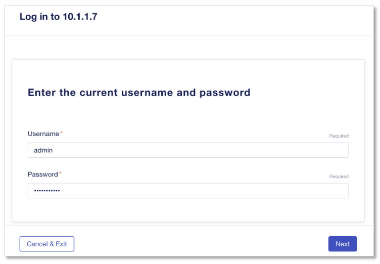
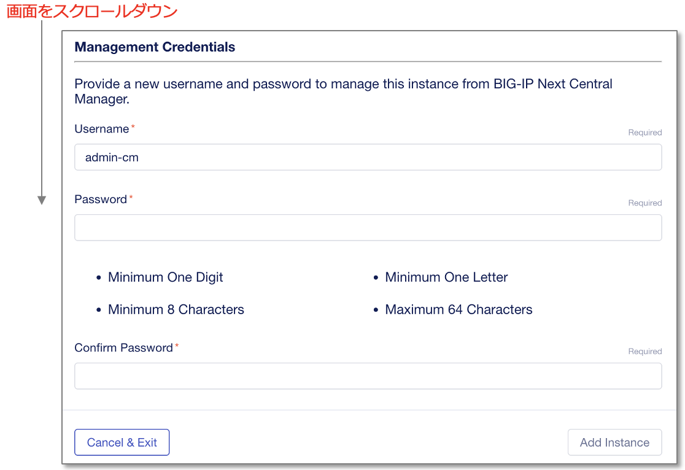
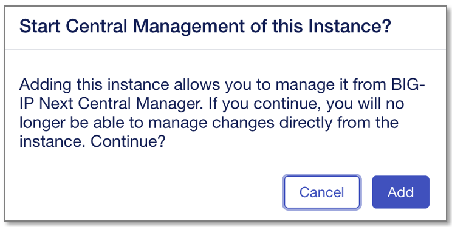
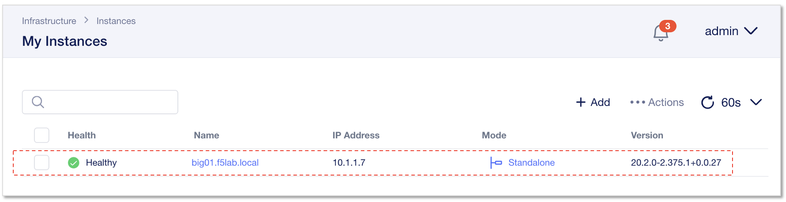

Central ManagerへのNextインスタンス登録
======================================

UDF環境からCM GUIへのアクセス
--------------------------------------

UDF画面上部タブの"DEPLOYMENT"をクリックし、BIG-IP Next Central Managerインスタンスの"ACCESS" > "GUI" を選択します。

|
|
BIG-IP Next CM GUIへのログイン
--------------------------------------

ログインプロンプトが表示されたら、ユーザ名/パスワードを入力してログインします。

- ユーザー名/パスワード:
   - **admin/Welcome123!**

ログインすると次のようなホーム画面が確認できます。

|
|
BIG-IP Next Instance1 をCMへ登録
--------------------------------------

ホーム画面の"Manage Instances"をクリックします。

|
“Start Adding Instances”をクリックします。

|
NEXTインスタンスのIPアドレスを入力します。

- IP Address/FQDN:
   - **10.1.1.7**
- **"Connect"** をクリック

|
NEXTインスタンスのCredentialを入力します。

- Username:
   - **admin**
- Password:
   - **Welcome123!**
- **"Next"** をクリック

|
BIG-IP Next CMからNextインスタンスを管理するためのCredentialを設定し、”Add Instance”クリックします。

- Username:
   - **admin-cm**
- Password/Confirm Password:
   - **Welcome123!**
- **"Add Instance"** をクリック

|
確認画面が表れますので、”Add”クリックします。

- **"Add"** をクリック

|
すると、以下のようにBIG-IP Nextインスタンスが管理インスタンスリストに追加されます。

