Nextインスタンス　ライセンスアクティベーション
======================================

ライセンスオーバービュー
--------------------------------------

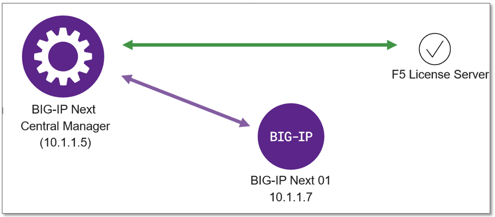
|
- BIG-IP Nextインスタンス用のライセンスは、Central ManagerにLoadし、Central Managerがライセンス管理を行う
- Central Managerが、F5のライセンスサーバと通信を行い利用状況等をチェック
- BIG-IP Next Central Manager自体には、ライセンスは不要 (無償製品)
- 参考URL
  - https://clouddocs.f5.com/bigip-next/latest/use_cm/cm_license_bigip_next.html 

|
ライセンスの入手
--------------------------------------

.. note::
   UDFハンズオンラボでは、JWTキーのライセンスは既にCM上にインストールしているものがあり、MyF5からのライセンス入手は実施不要です。あるいは、MyF5サイトから自身のアカウントで発行したライセンスを本手順に従ってインストールしてご利用いただくことも可能です。

MyF5よりTrialライセンス(JWTキー)を入手します。

- https://my.f5.com/

"TRIALS"をクリックします。

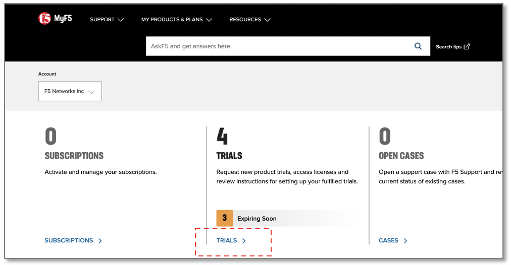

|
"BIG-IP Next"をクリックします。

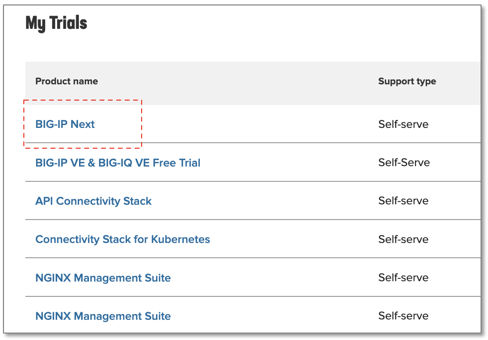

|
“Downloads and licenses”をクリックします。

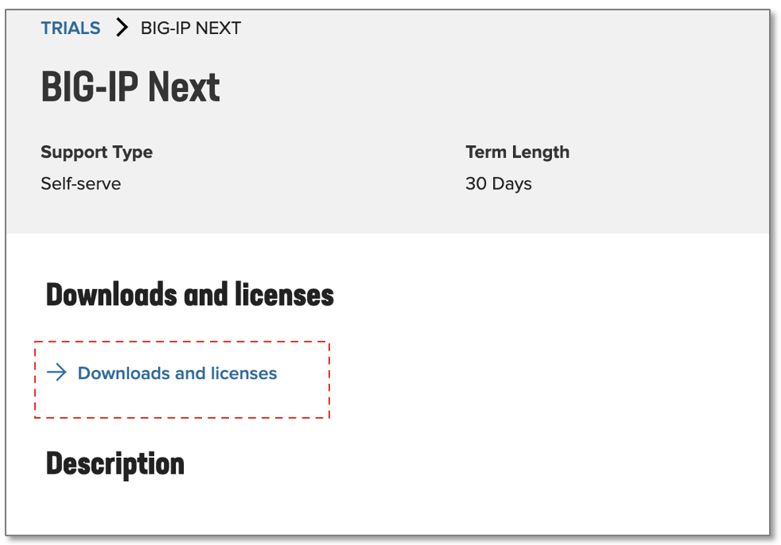

|
“Copy JSON Web Token”をクリックしてテキストエディタにペーストしておくか、Downloadして保存しておきます。

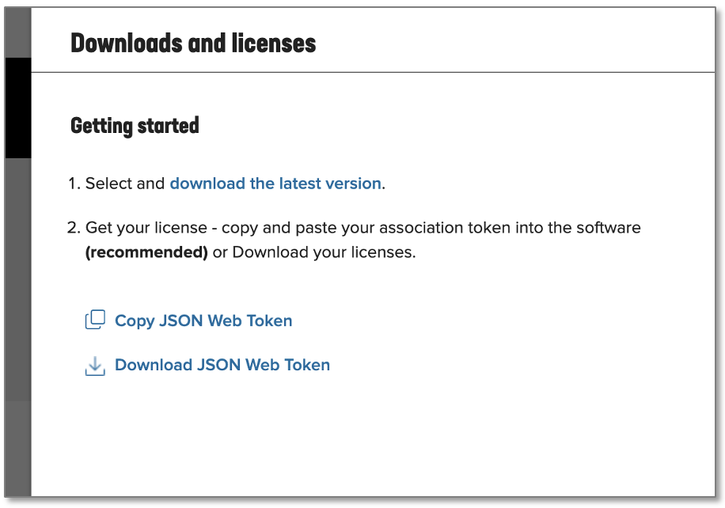

|
ライセンスのインストール
--------------------------------------

BIG-IP Next CMにログインし、Infrastructure (Manage Instances)の画面で、ライセンスをアクティベーションするインスタンスをクリックします。

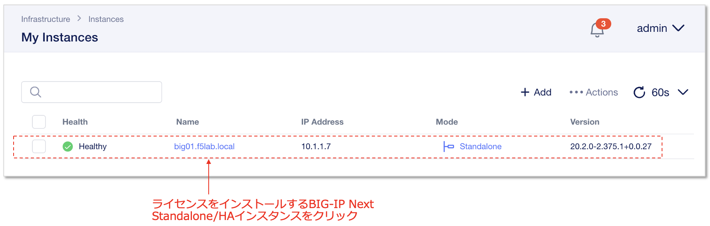

|
左部メニューから **“License”** を選択し、 **“Activate License”**　をクリックします。

.. figure:: images/c5-m2-7.png
   :scale: 50%
   :align: center

|
確認画面で **"Next"** をクリックします。

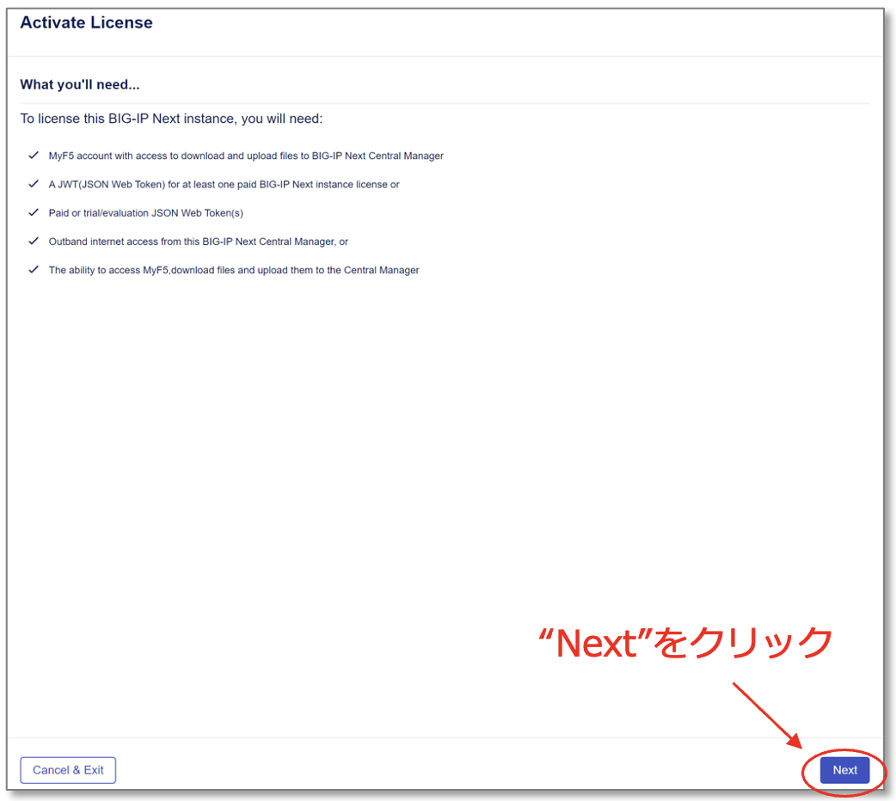

|
新規ライセンスをインポートして使用する場合
--------------------------------------

.. note::
   CMインストール済みライセンスを使用する場合は本手順をスキップして次の"既存ライセンスを使用してアクティベーションする場合"を実施してください。

JWTライセンスキーをNew Tokenとして登録、アクティベーションします。

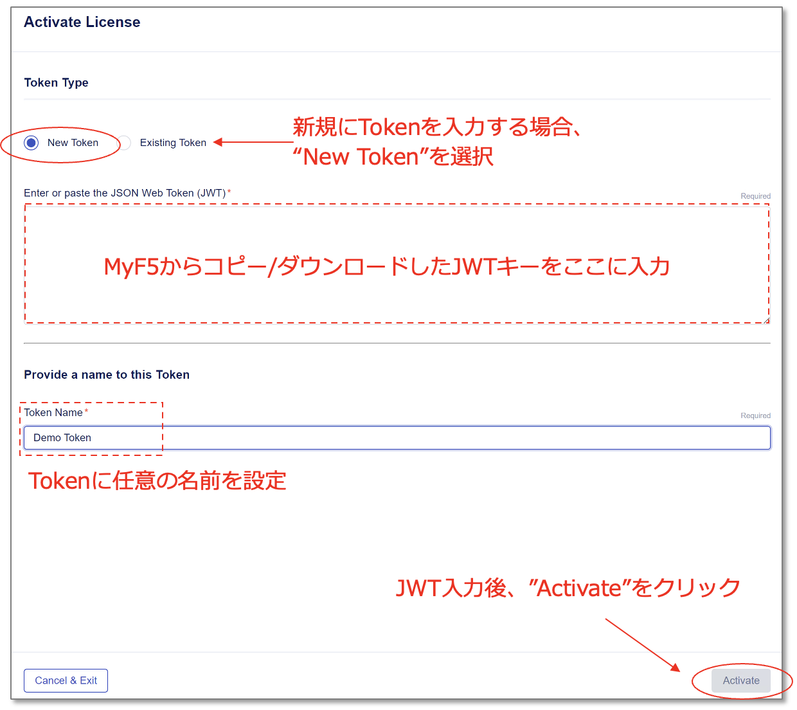

- **"New Token"** を選択
- Enter or paste the JSON Web Token(JWT)
   - 保存したJWTキーをペーストする
- Token Name:
   - **demo token** （任意の名前で可）
- **"Activate"** をクリック

|
既存ライセンスを使用してアクティベーションする場合
--------------------------------------

既存のインストール済みライセンスを使用してライセンスアクティベーションを実施します。

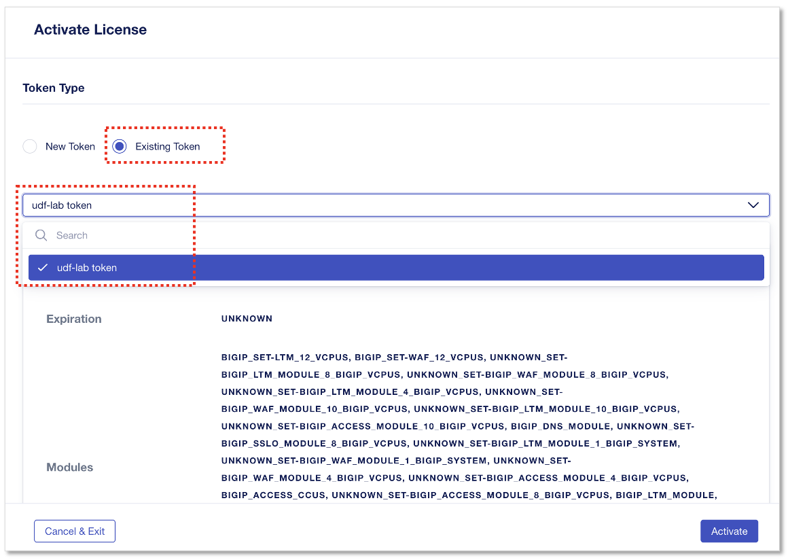

- **"Existing Token"** を選択
- ドロップダウンメニューから、 **"udf-lab token"** を選択
- **"Activate"** をクリック

|
ライセンス状態の確認
--------------------------------------

ライセンスのStatusが **”Active”** になっていることを確認します。

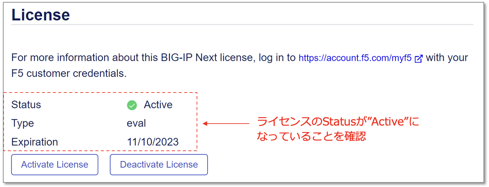

|
（参考）ライセンスアクティベート後、各モジュールのプロビジョニングが可能になります。

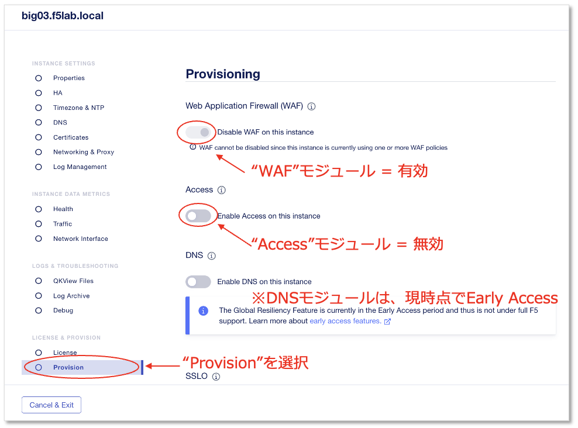

この例の場合、

- WAF: 有効化済み (ポリシーが適用されているため無効化できないのでグレーアウトされている)
- Access: 無効化 (有効化可能)
- DNS: 無効化 (有効化可能)
となります。
