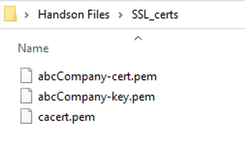
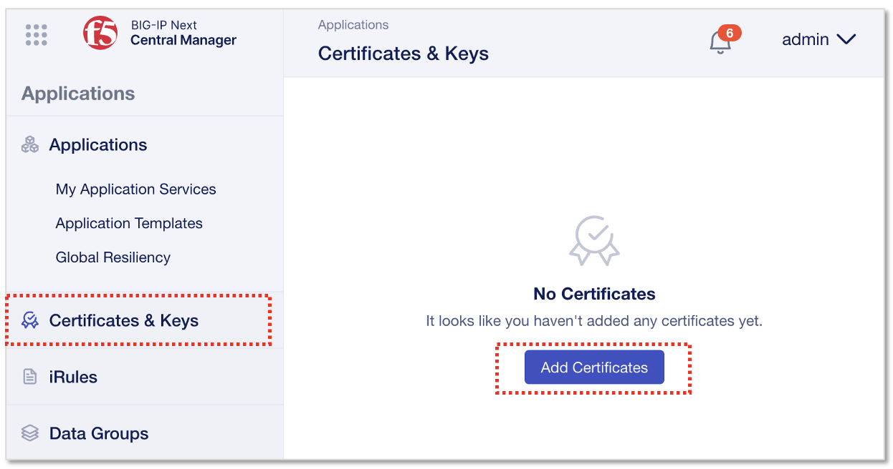
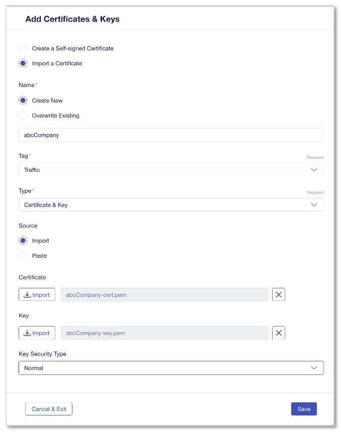
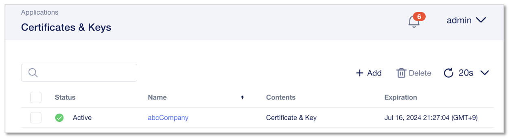

証明書のインポート
======================================

認証局で署名されたサーバ証明書をインポートして利用する方法を記載します。

サーバ証明書の準備
--------------------------------------

一般的には、BIG-IPのGUIでCSRと秘密鍵を生成し、CSRを認証局 (例:ベリサイン等)に送付します。
そのCSRに対して、認証局が署名を行うことでサーバ証明書が完成します。そのサーバ証明書を返送してもらい、インポートします。
本ガイドでは簡易的に、秘密鍵ファイルとサーバ証明書の両方がすでに存在しているものとし、両方をインポートする手順とします。

.. note::
   F5 UDFラボでは、リモートデスクトップ接続したPCのデスクトップ上に準備してある証明書を使用します。

Windows10 client 
デスクトップ > Handson Files > SSL_certs

このフォルダ内の以下2つのファイルを使用します。

- 秘密鍵ファイル: abcCompany-key.pem
- サーバ証明書ファイル: abcCompany-cert.pem

これらのファイルをローカルPCにコピーしてローカルPC上のブラウザからCMを操作するか、コピー不可の場合はUDFのWindows10 client上のChromeからCMを開き(https://10.1.1.5)、次の証明書インポート作業を実施してください。

|
秘密鍵とサーバ証明書のインポート
--------------------------------------

”Applications”から”Certificates&Keys”を選択し、”Add Certificates”をクリックします。

|
インポートする証明書の指定、選択を行います。

- **import a Certificate** を選択
- Name:
   - **Create New**　を選択
   - **abcCompany**
- Tag:
   - **Traffic**
- Type:
   - **Certificate & Key**
- Source:
   - **Import**
- Certificate:
   - **import (abcCompany-cert.pemファイルを選択)**
- Key:
   - **import (abcCompany-key.pemファイルを選択)**
- Key Security Type:
   - **Normal**
- **"Save"** をクリック

|
正常にインポートされると、ステータス"Active"と表示されるようになります。

