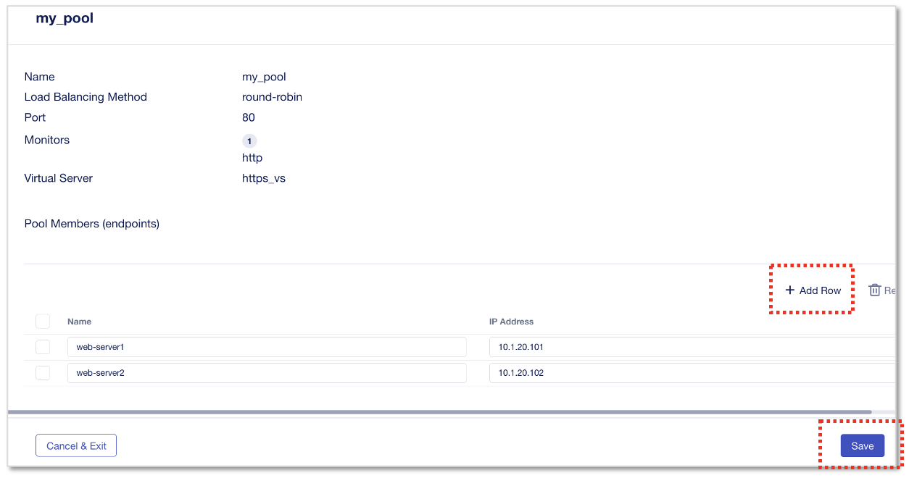

HTTPSアプリケーションの設定
======================================

HTTPS Serviceテンプレートを利用したWebアプリケーションの作成
--------------------------------------

CM画面左上部のworkspaceから、”Applications”を選択します。

.. figure:: images/c7-m2-1.png
   :scale: 50%
   :align: center

|
**”+Add Application”** をクリックします。

.. figure:: images/c7-m2-2.png
   :scale: 50%
   :align: center

|
新規アプリケーション作成を開始するにあたりアプリケーション名とテンプレート選択をおこないます。

- Application Service Name:
   - **HTTPS-Service**　（任意の名前）
- What kind of Application:
   - **From Template**　を選択
- **“Select Template”** をクリック

|
次画面のドロップダウンメニューからテンプレートを選択します。

- Application Template:
   - **HTTPS-Load-Balancing-Service** を選択
- **“Start Creating”** をクリック

|
Application Service Propertiesの設定画面で、Virtual Server、Pool、Protocol Profiles等の構成を定義します。
HTTPSテンプレートのデフォルト設定値が反映済みの状態です。 **"Protocols & Profiles"** のEditをクリックします。

- Virtual Server Name:
   - **https_vs**
- Pool:
   - **my_pool**
- **"Protocols & Profiles"** のEditをクリック

|
No Client-Side TLS の **”Add”** をクリックします。

|
Client-Side TLS の証明書設定を行います。

- Name:
   - **abcCompany**
- RSA Certificate:
   - **abcCompany**
- **Use Default Server** を選択
- **Save** を２回クリックします

|
Poolの設定を確認します。　Pool memberのIPは後工程のアプリケーションDeploy時に設定します。

- **“Pools”** タブをクリック
- Pool Name:
   - **my_pool**
- Server Port:
   - **80**
- Load-Balancing Mode:
   - **round-robin**
- Monitor Type:
   - **http**
- **”Review & Deploy”** をクリック

|
次ページの **“Start Adding”** をクリックし、デプロイするインスタンスを選択します。

- **“big01.f5lab.local”** のチェックボックスをチェックする
- **“+Add to List”** をクリック

|
次のDeploy画面で、Virtual ServerのIPとPool memberを設定します。

- Virtual Address:
   - **10.1.10.100**
- Membersの下矢印を展開し、 **“+Pool Members”** をクリック

|
Pool memberを設定します。

- **“+Add Row”** を２回クリックし2member分作成
- Pool Members:
   - Name: **web-server1** , IP Address: **10.1.20.101**
   - Name: **web-server2** , IP Address: **10.1.20.102**
- 入力後、 **”Save”** をクリック

|
設定内容に問題ないかを適用前に検証し、本番適用します。

- **“Validate All”** をクリックして設定内容を検証、エラーがなく”Validated”の結果が表示されること
- **“View Results”** で設定反映されるAPI内容を確認可能です
- **“Deploy Changes”** をクリックし、次に表示される画面で **”Yes, Deploy”** をクリックします

|
作成したアプリケーションがリストに表示されます。

|
作成したアプリケーションをクリックすると、設定オブジェクトと状態確認、設定編集が可能です。

