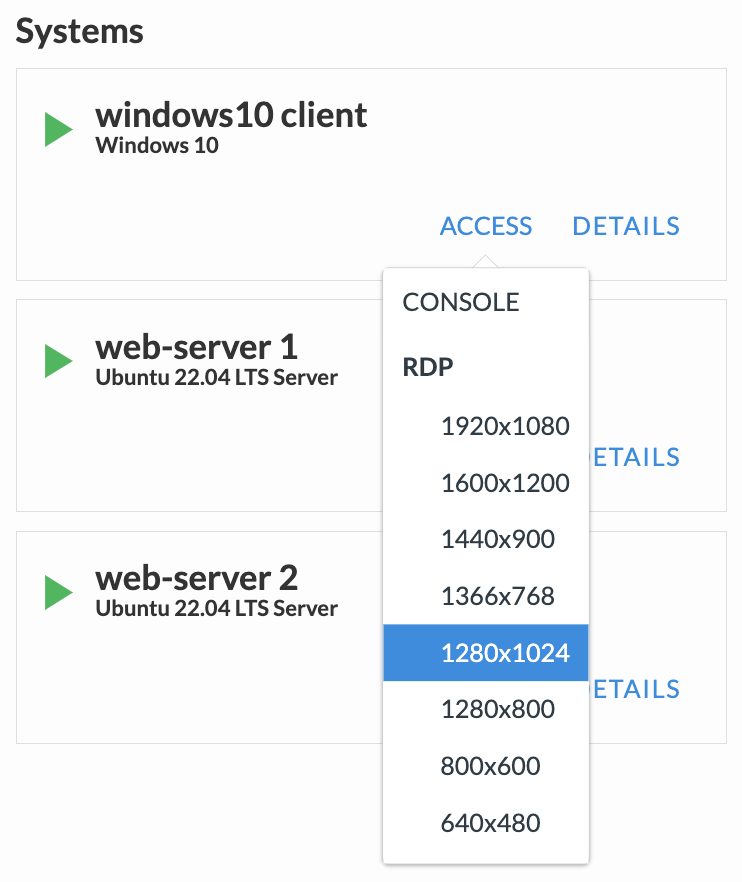
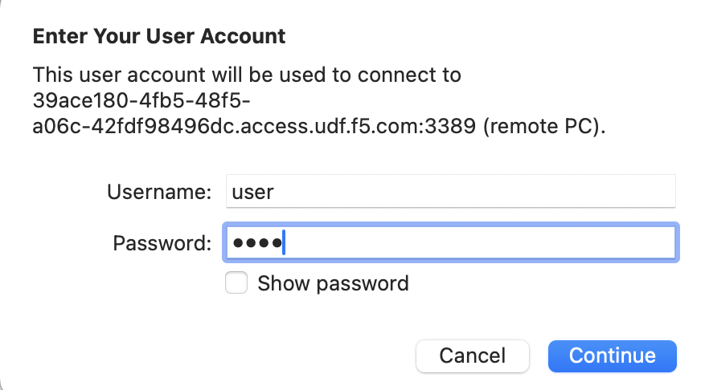
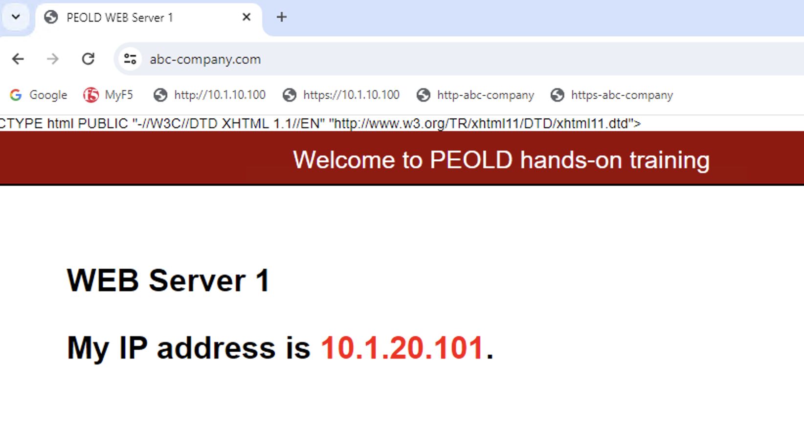

HTTPSアプリケーションの通信確認
======================================

UDF環境からWindows Clientへのアクセス方法
--------------------------------------

UDF画面上部タブの"DEPLOYMENT"をクリックし、Windows Clientインスタンスの"ACCESS" > "RDP" を選択します。

.. note::
   RDPが上手く動作しない場合は、"CONSOLE"をお試しください。

|
Windows Clientへのログイン
--------------------------------------

ログイン画面が表示されたら、ID/パスワードを入力します。

- ユーザー名/パスワード:
   - **user/user**

|
デスクトップ上のChromeブラウザを開き、ブックマックバーから **https-abc-company** (https://10.1.10.100/) をクリックして作成したアプリケーションのVirtual Serverへアクセスします。
下記のようなWebコンテンツが表示されれば通信確認完了です。スタートメニューのChromeアイコンを右クリックし、新規シークレットウィンドウ(New Incongnite window)を開いて再アクセスすると、2台のWebサーバからそれぞれ異なるコンテンツが返ってくることが確認できます。

