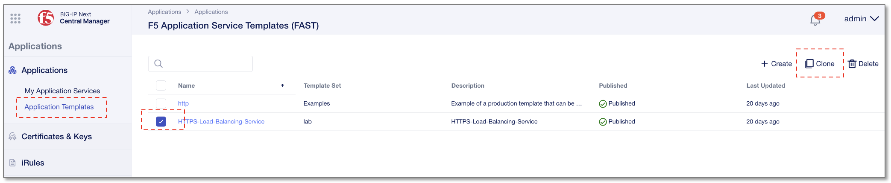
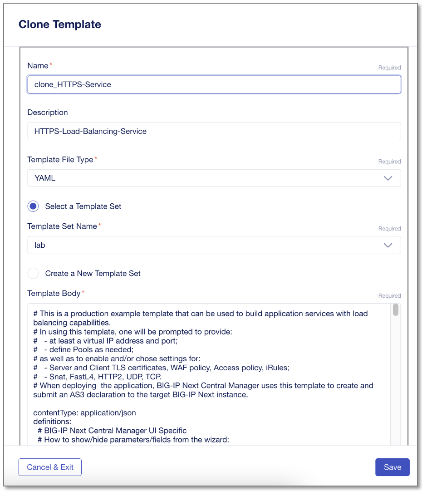
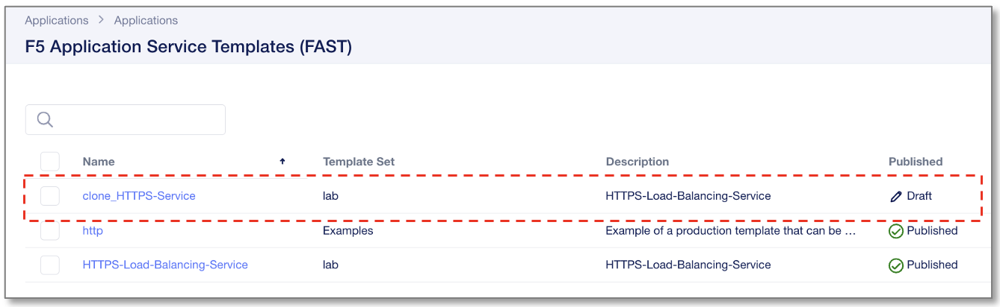
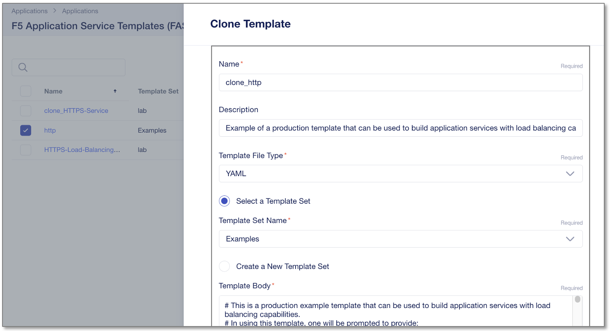

テンプレートのクローン作成
======================================

テンプレートをカスタマイズする前に、まず既存テンプレートのクローンを作成していきます。

HTTPSテンプレートのクローン作成
--------------------------------------

**"Application Templates"** 画面を開き、 **”HTTPS-Load-Balancing-Service”** テンプレートのクローンを作成します。

- **”HTTPS-Load-Balancing-Service”** のチェックボックスをチェック
- 右上の **”Clone”** をクリック

|
クローンテンプレートを作成、保存します。

- Name:
   - **clone_HTTPS-Service**
- **“Save”** をクリック

|
アプリケーションテンプレートの一覧に作成したクローンが確認できます。

|
HTTPテンプレートのクローン作成
--------------------------------------

同じ手順で、httpテンプレートのクローンも作成しておきます。

- Name:
   - **clone_http**
- **“Save”** をクリック
