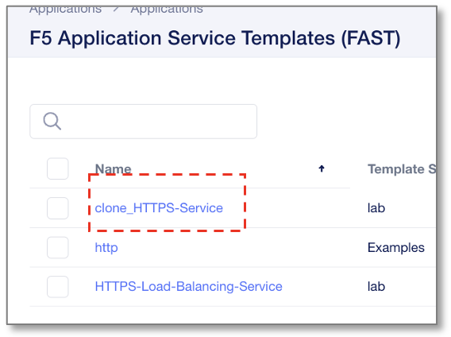
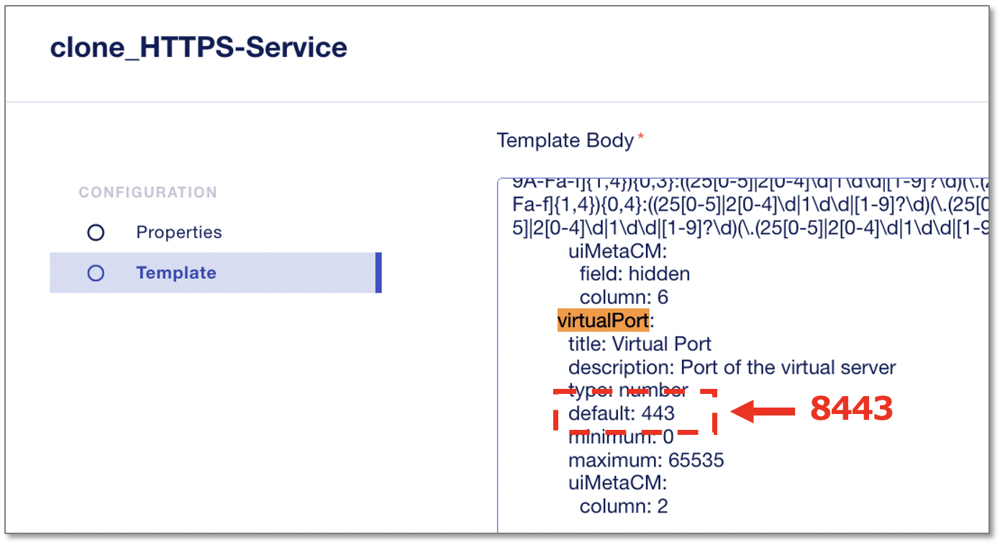
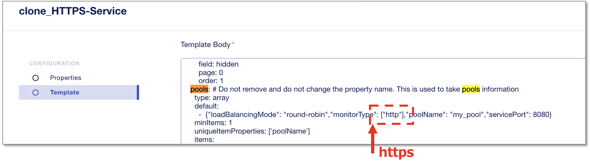
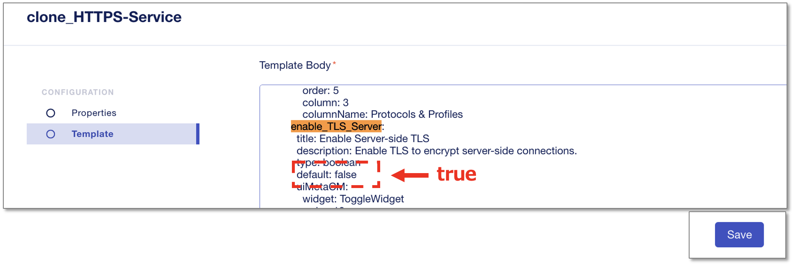
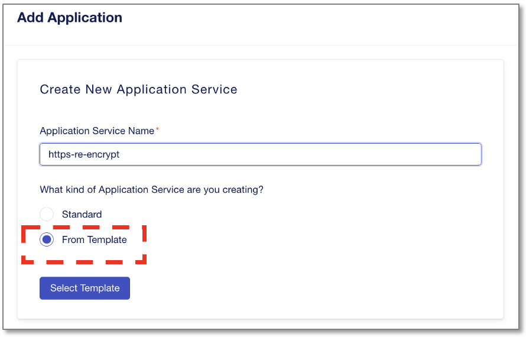
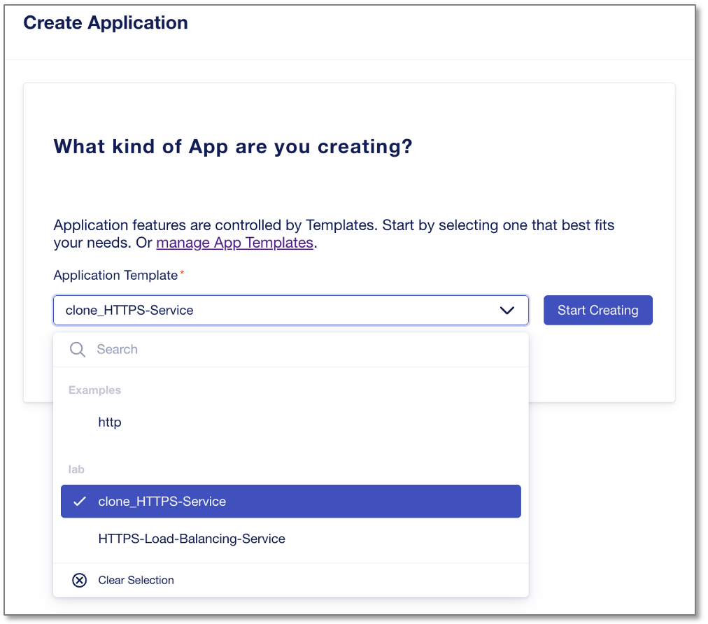
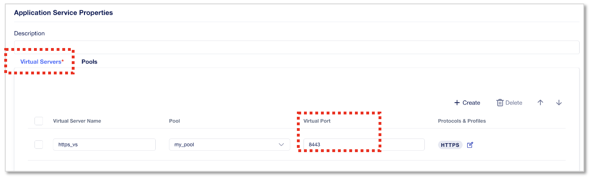
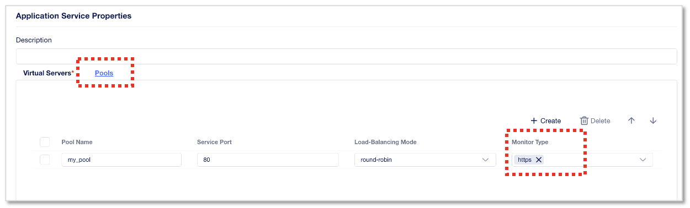
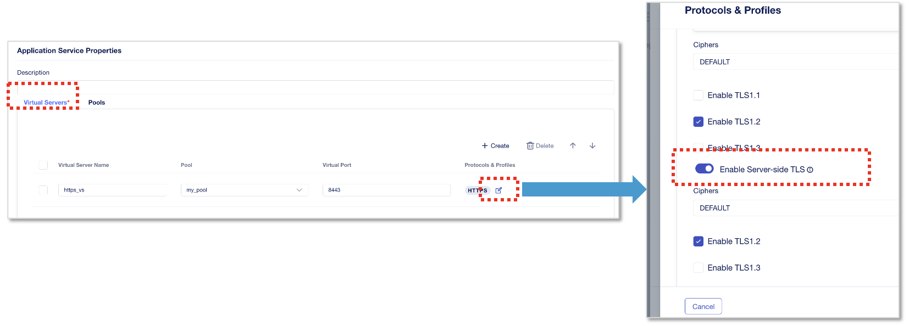

HTTPS Virtual Serverのカスタマイズ
======================================

Virtual Serverの各種デフォルトの設定値を変更します。
作成したクローン **clone_HTTPS-Service** をクリックします。

|
Virtual Server Portを443から8443へ変更
--------------------------------------

Template Bodyの中の、defaultポート番号設定の箇所を **”443”** から **”8443”** へ変更します。

※ **virtualport** や **443** 等の文字列でブラウザ文字検索すると該当箇所を簡単に見つけることができます。

|
default Monitor typeをhttpからhttpsへ変更
--------------------------------------

Template Bodyの中の、Monitor Typeを **”http”** から **”https”** へ変更します。

※ **pools** 等の文字列でブラウザ文字検索すると該当箇所を簡単に見つけることができます。

|
Server-Side-TLSをdefault falseからtrueへ変更
--------------------------------------

Template Bodyの中の、Server-Side-TLSを **default false** から **true** へ変更します。

※ **enable_TLS_Server** 等の文字列でブラウザ文字検索すると該当箇所を簡単に見つけることができます。

- 変更後、 **“Save”** をクリック

|
変更後のテンプレート確認
--------------------------------------

Template Body変更・Save後に、変更内容がテンプレートに反映されているか確認します。
"My Application Services"から“+Add Application”をクリックします。

- Application Service Name:
   - **https-re-encrypt**
- What kind of Application:
   - **From Template**　を選択
- **”Select Template”** をクリック

|
作成、編集した”clone_HTTPS-Service”を選択し、”Start Creating”をクリックします。

|
- **Virtual Portがdefault 8443に変わっていることが確認できます。** 

|
- **Monitor Typeがdefault設定でhttpsに変わっていることが確認できます。** 

|
- **Server-Side TLSがdefault Enableとなっていることが確認できます。** 

|
Cancelしてダッシュボードに戻ります。
