TCP Profileのカスタマイズ
======================================

TCP Profileをカスタマイズし、設定項目を追加します。
先に現状のテンプレート内容を確認します。

|
変更前の状態確認
--------------------------------------

作成済みのアプリケーション”HTTP-Service”を開き、右上の”Edit”マークをクリックします。

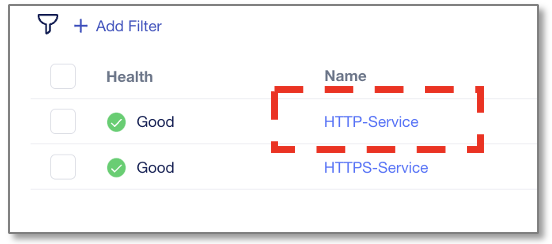

|
”Protocols & Profiles”のEditマークをクリックします。

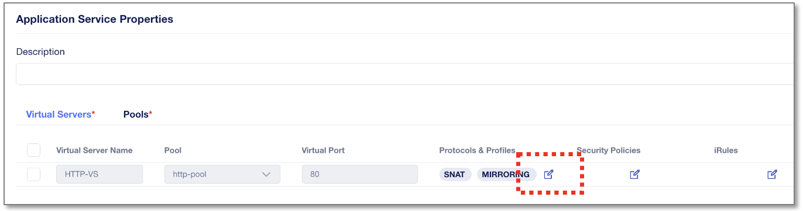

|
”Enable TCP Profile”を有効にすると、TCP Idle Timeout値のみ設定オプションとして見えます。

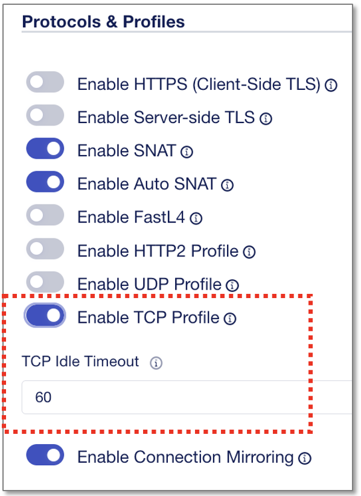

|
キャンセルしてトップに戻ります。

テンプレートの中身も見ていきます。"Application Templates"画面で作成した”clone_http”をクリックします。

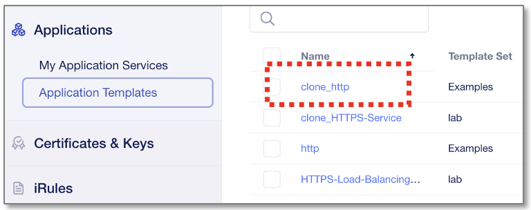

|
Template Bodyを確認すると、TCP Profileにdependした”TCP_idle_timeout”のParameterが含まれています。

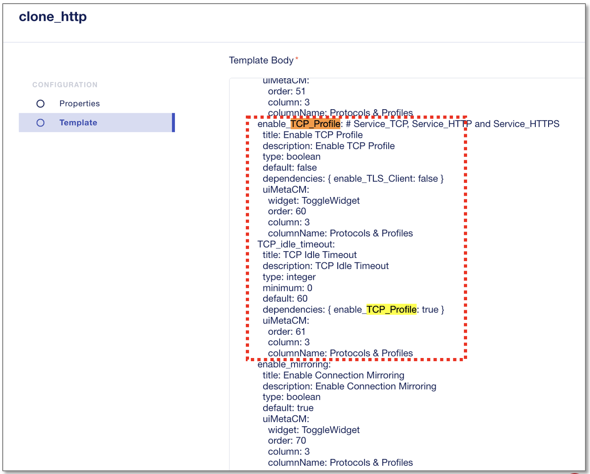

|
TCPパラメーターの追加
--------------------------------------

TCP追加パラメーターとして **"TCP Proxy Buffer High"** を設定します。

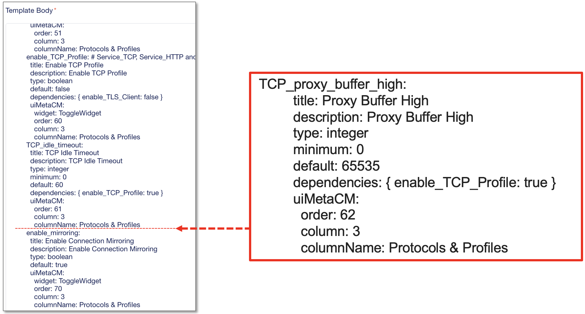

|
上記該当箇所に、以下テキストをコピーペーストして挿入し、 **"Save"** してください。

※直上の”TCP_idle_timeout”を参考に、スペース・インデントを合わせるようご注意ください。

.. code-block:: cmdin

          TCP_proxy_buffer_high:
            title: Proxy Buffer High
            description: Proxy Buffer High
            type: integer
            minimum: 0
            default: 65535
            dependencies: { enable_TCP_Profile: true }
            uiMetaCM:
              order: 62
              column: 3
              columnName: Protocols & Profiles

変更後のテンプレート

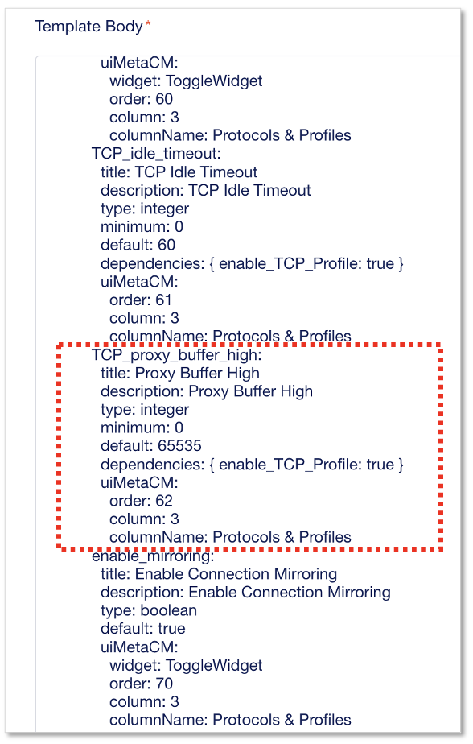

|
変更後のテンプレート確認
--------------------------------------

Template Body変更・Save後に、変更内容がテンプレートに反映されているか確認します。
"My Application Services"から“+Add Application”をクリックします。

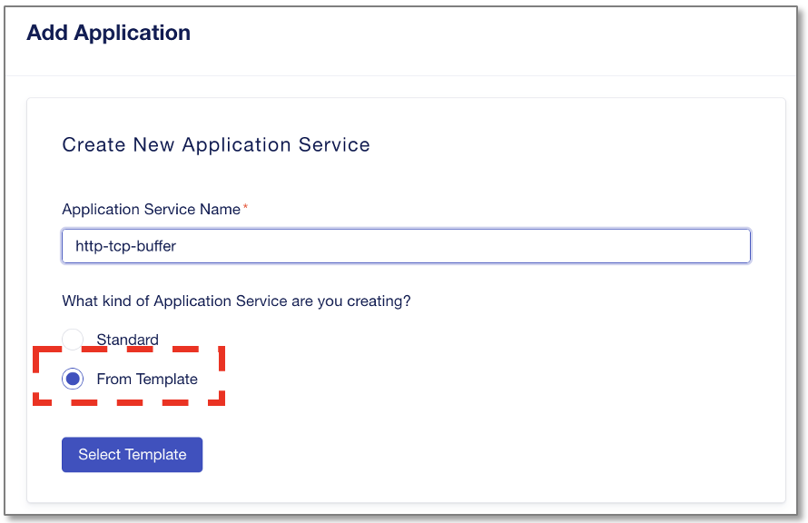

- Application Service Name:
   - **http-tcp-buffer**
- What kind of Application:
   - **From Template**　を選択
- **”Select Template”** をクリック

|
作成、編集した”clone_http”を選択し、”Start Creating”をクリックします。

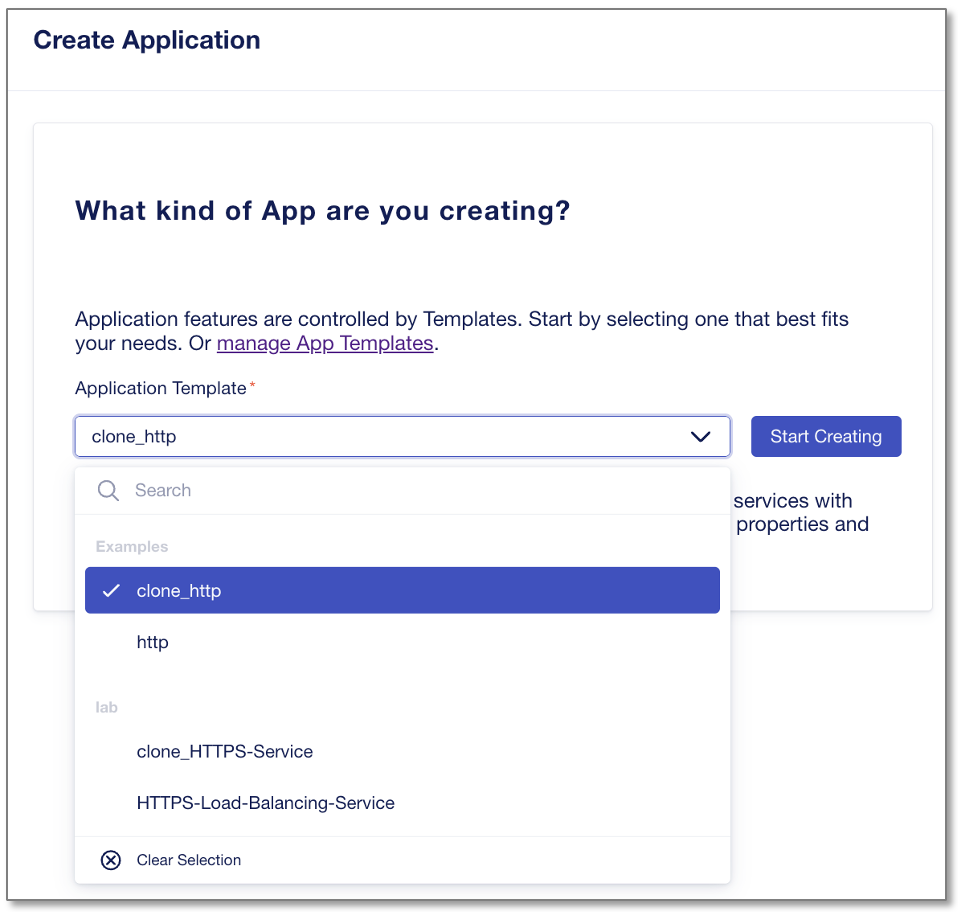

|
”Start Creating”をクリックします。

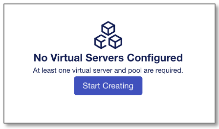

|
”Protocols & Profiles”のEditマークをクリックします。

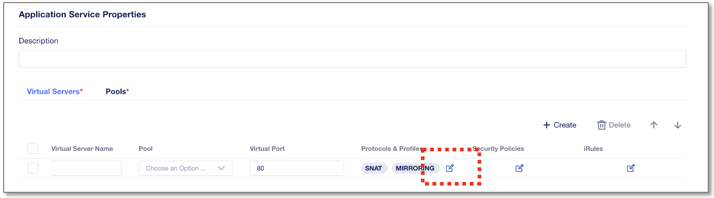

|
”Enable TCP Profile”を有効にすると、"Proxy Buffer High"の設定項目が増えています。

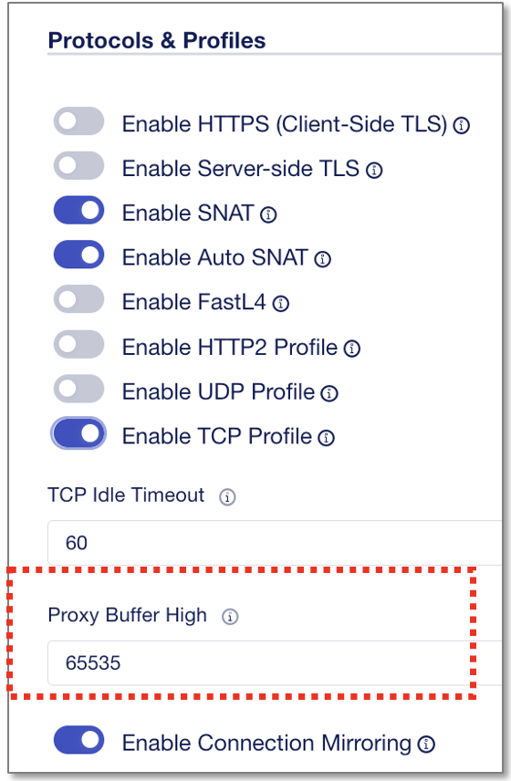

Cancelしてダッシュボードに戻ります。
