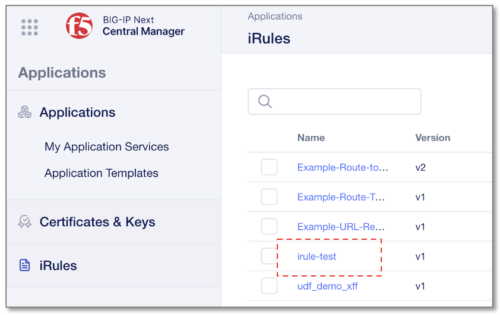
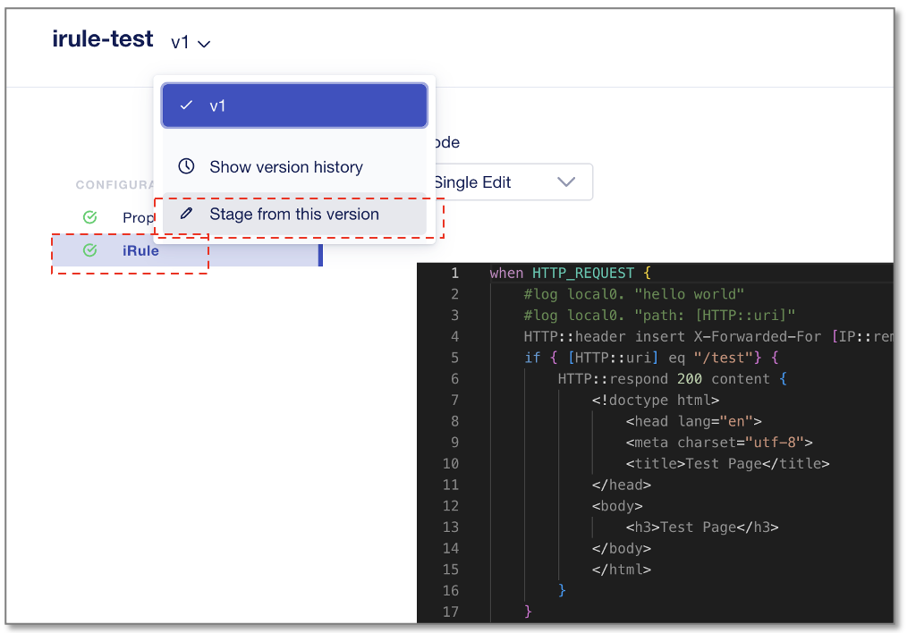
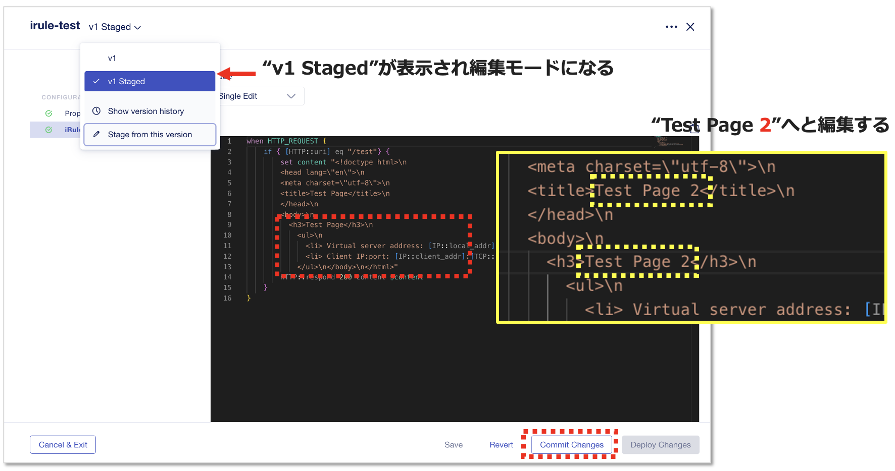
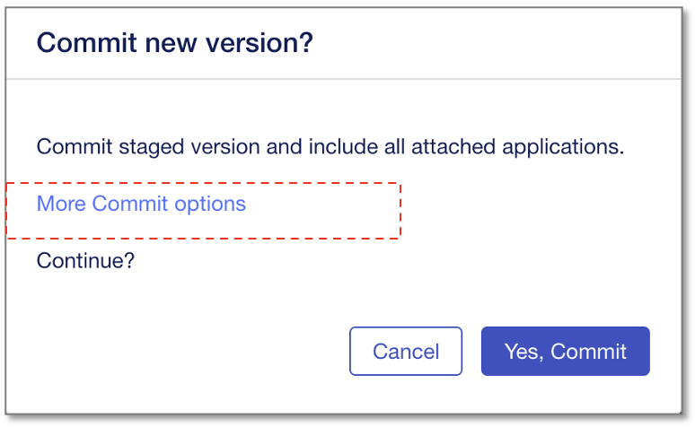
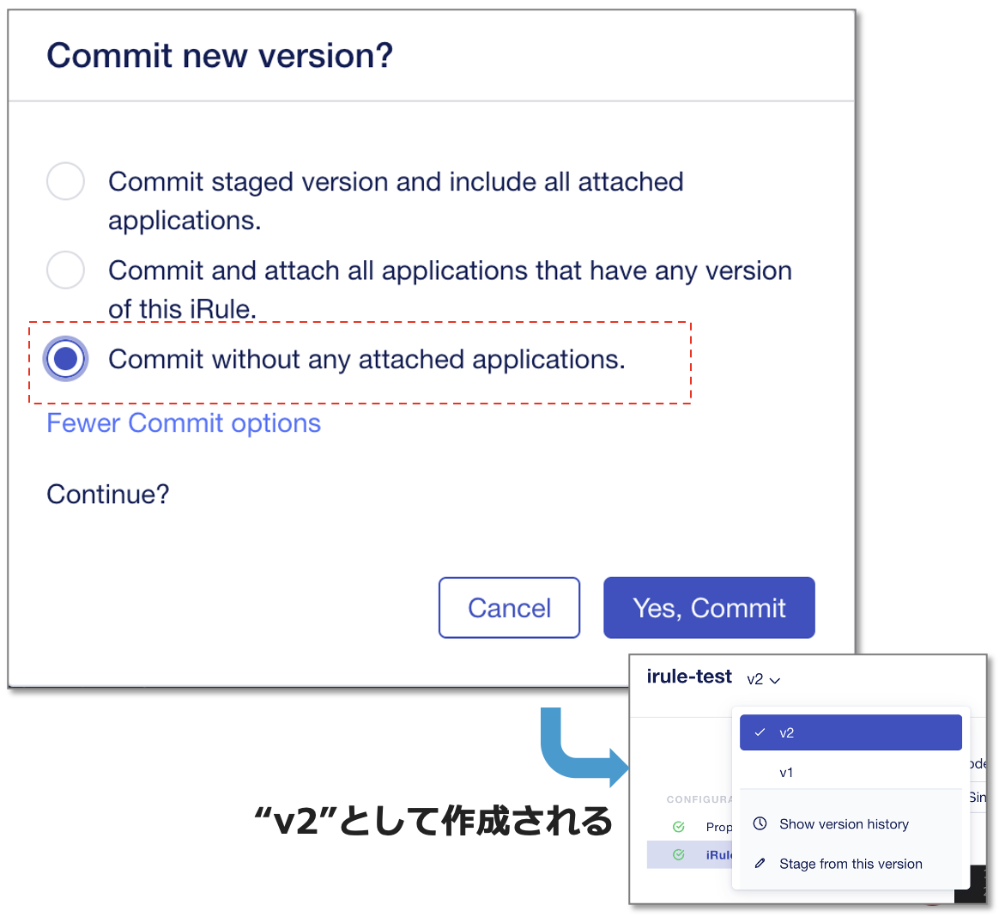
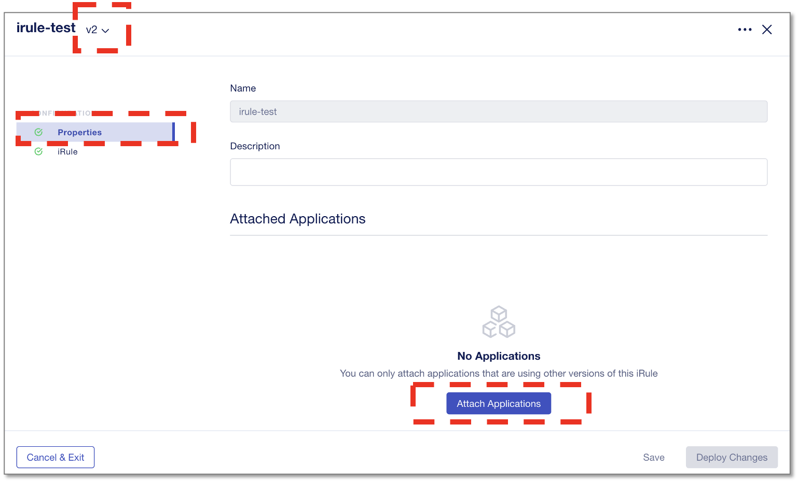
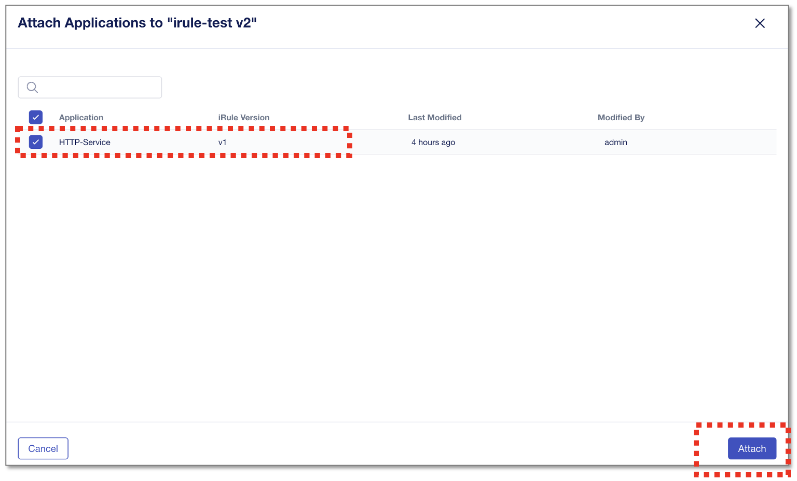
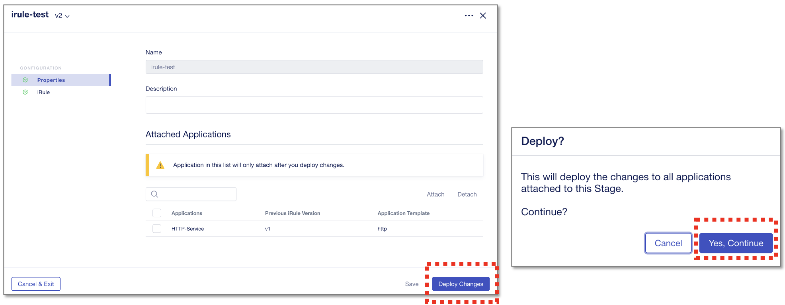
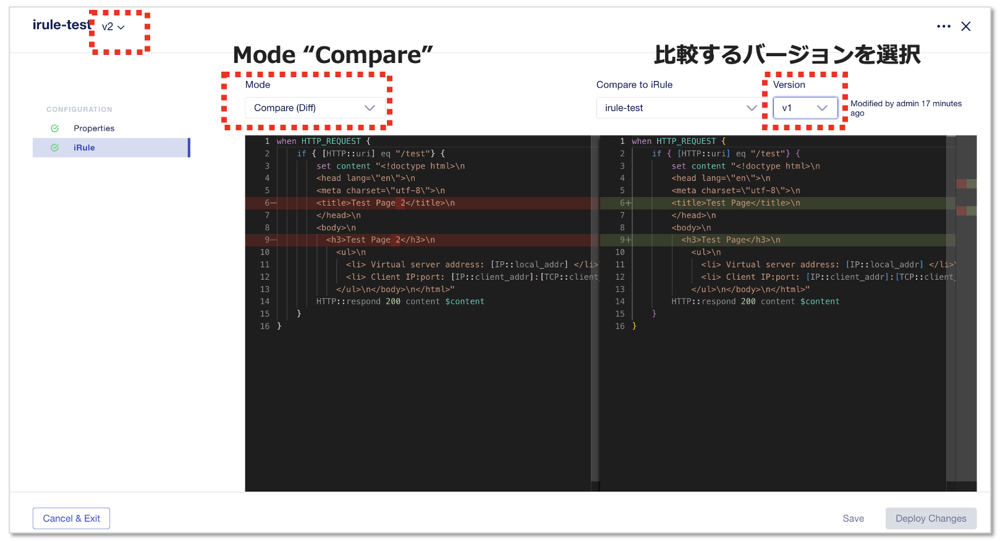
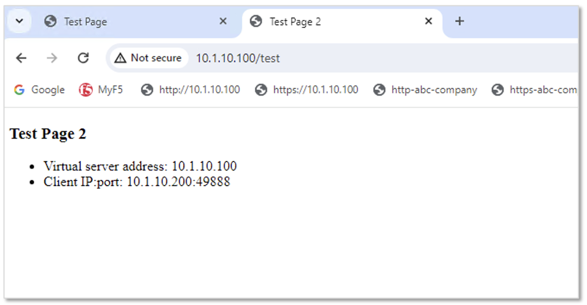

iRuleの変更とバージョニング
======================================

iRuleを部分編集し、履歴管理の機能を確認します。

iRuleの変更
--------------------------------------

Applications > iRules画面から、作成した”irule-test”をクリックします。

|
画面上部”v1”のドロップダウンメニューから“Stage from this version”を選択します。

|
すると、“v1 Staged”が表示され編集モードになります。
HTMLコンテンツ内容を、"Test Page"から **"Test Page 2"** へと編集します。

編集後、 **”Commit Changes”** をクリックします。

|
次の確認画面にて、 **“More Commit options”** をクリックしてオプション画面を開きます。

|
更新後のiRuleが関連アプリケーションで直ちに有効にならないように、 **“Commit without any attached applications”** を選択し、“Yes, Commit”をクリックします。

すると、更新版の **"v2"** として作成されます。

|
更新iRuleの適用
--------------------------------------

更新された”v2”のiRuleを適用します。
"Properties"をクリックし、画面の上部ドロップダウンから "v2" を選択して "Attach Applications" をクリックします。

|
現状“v1”が適用されているHTTP-Serviceのチェックボックスをチェックし、 **"Attach"** をクリックします。

|
次の確認画面で **"Deploy Changes"** をクリックし、 **"Yes, Continue"** をクリックします。

|
iRule画面で、次のように新旧バージョンの差分比較が可能です。

|
クライアントからサーバへの通信確認を行います。 Windows clientのブラウザから
 **http://10.1.10.100/test**　のURLへアクセスを試行します。

"Test Page 2" の画面が表示されると、更新後の"v2"iRuleからコンテンツを返しています。
