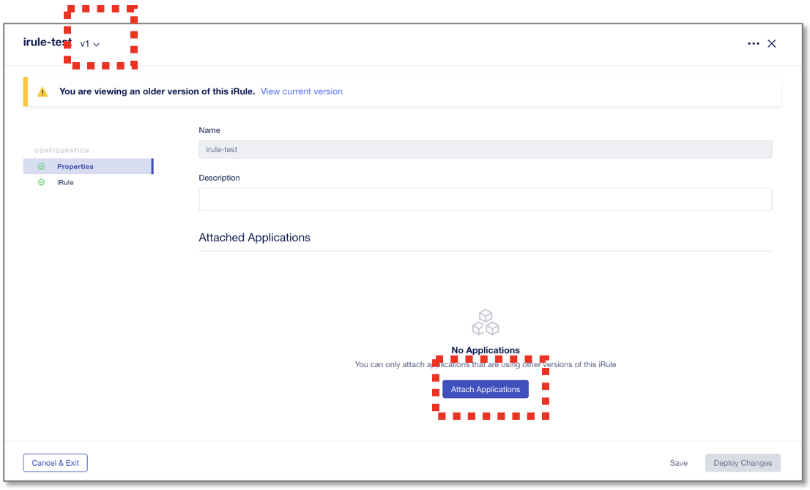
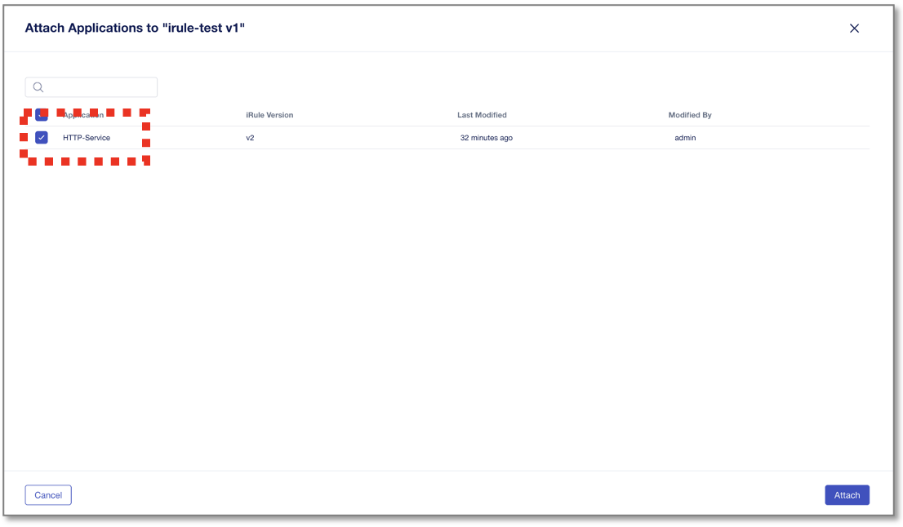
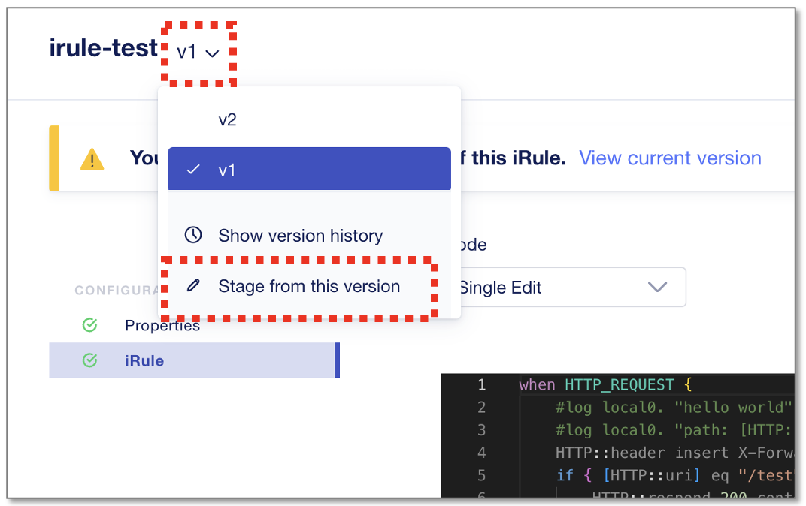
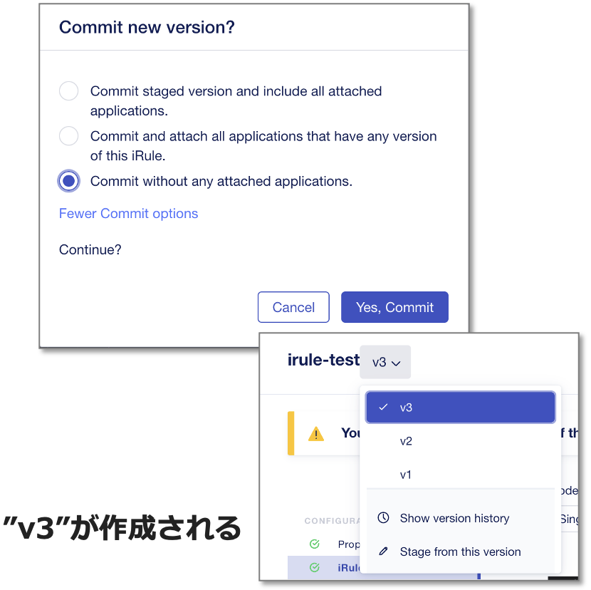
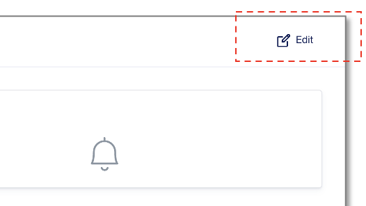
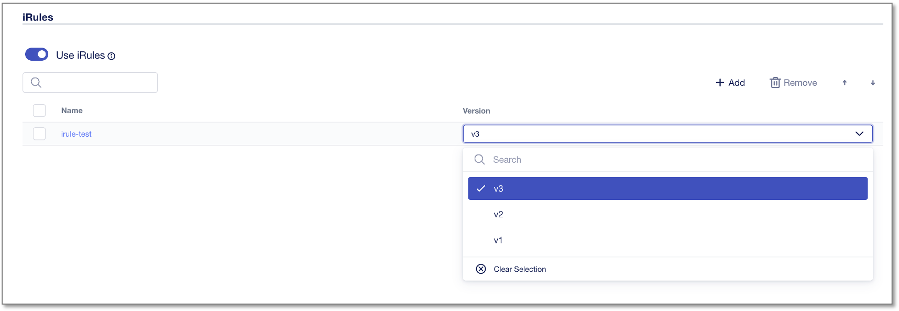
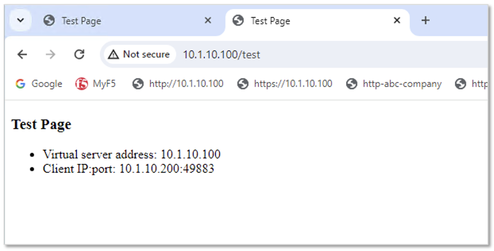

iRuleのロールバック
======================================

iRuleを、旧バージョンの以前の設定に戻す方法を確認します。
戻し方の考え方は２通りあり、

- “v1”ルールを充て直す
- “v1”ルールをコピーして”v3”として充て直す

どちらを採択すべきかは運用状況によりますが、手順的にはいずれも大差はありません。
本章では、後者の **“v1”ルールをコピーして”v3”として充て直す** 手順で実施することとします。

v1ルールの充て直し（参考）
--------------------------------------

.. note::
   このv1ルール充て直しは参考情報とし、ハンズオンラボは後半のv3として充てる手順を実施します。

“irule-test”の”v1”を選択し、“Attach Applications”をクリックします。

|
現状”v2”が適用されているHTTP-Serviceをチェックして"Apply"、“Deploy Changes”をクリックします。

以上で"v1" iRuleへのロールバックは完了です。

|
v3ルールとして充て直し
--------------------------------------

旧iRuleに戻す際、履歴バージョンをv3としてリビジョンアップして適用し直します。

以前の”v1”の状態で”Stage from this version”を選択し、“Commit Changes”をクリックします。

|
”More Commit Option”から”Commit without any attached applications”を選択し、”Yes, Commit”をクリックします。
すると同一iRuleが"v3"として作成されます。

|
アプリケーションへv3 iRuleを適用し直します。
My Application Servicesから作成済みの”HTTP-Service”をクリックします。

.. figure:: images/c9-m3-5.png
   :scale: 60%
   :align: center

|
次画面右上の”Edit”をクリックします。

|
iRuleの"Edit"ボタンをクリックします。

.. figure:: images/c9-m3-7.png
   :scale: 50%
   :align: center

|
Versionのドロップダウンメニューから“v3”を選択し、”Save”、”Review & Deploy”をクリックします。
次ページの"Deploy Changes", "Yes, Deploy"まで実行します。

|
クライアントからサーバへの通信確認を行います。 Windows clientのブラウザから
 **http://10.1.10.100/test**　のURLへアクセスを試行します。

"Test Page" の画面が表示されると、旧バージョンiRuleの"v3"からコンテンツを返しています。
