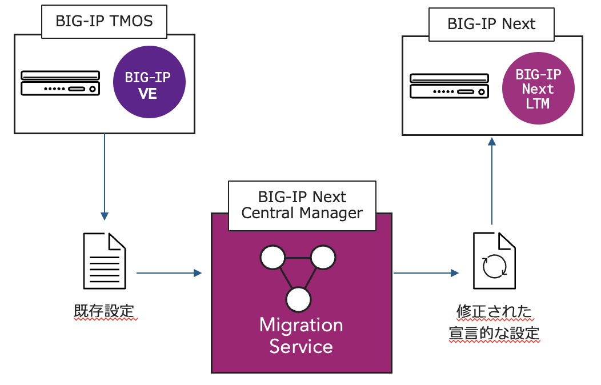

================================================
BIG-IP TMOSからの移行 (Migration Serevice)
================================================

Central Managerでは、TMOSからの移行支援ツールである **Migration Service** を標準機能として提供しています。

- 既存BIG-IP TMOSバージョン (v12.1以降)の設定を、BIG-IP Next互換に修正 
- BIG-IPのUCSファイルをBIG-IP Next向けのAS3定義に変換
- 移行における問題点を自動的に識別し、解決
- 移行後の診断およびメトリクスにより、デバイスのステータスを確認
- アプリケーション単位のマイグレーションをサポート

.. toctree::
   :titlesonly:
   :caption: 目次:
   :glob:

   module**/module**
