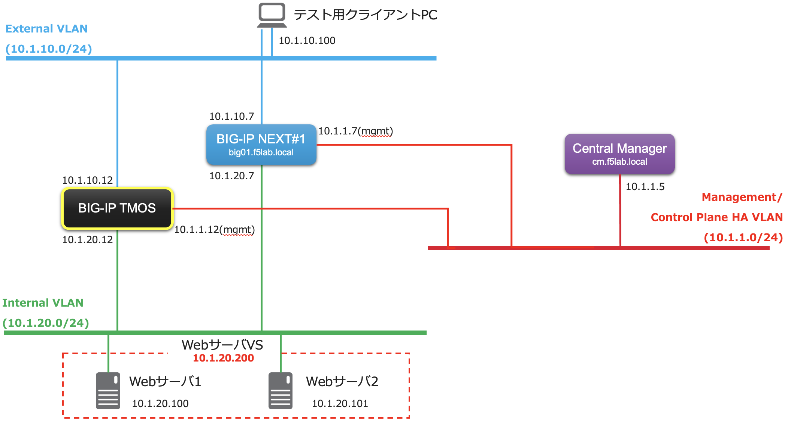
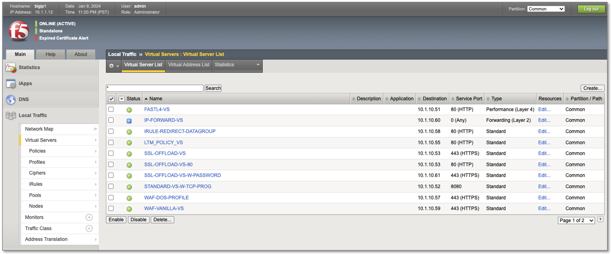
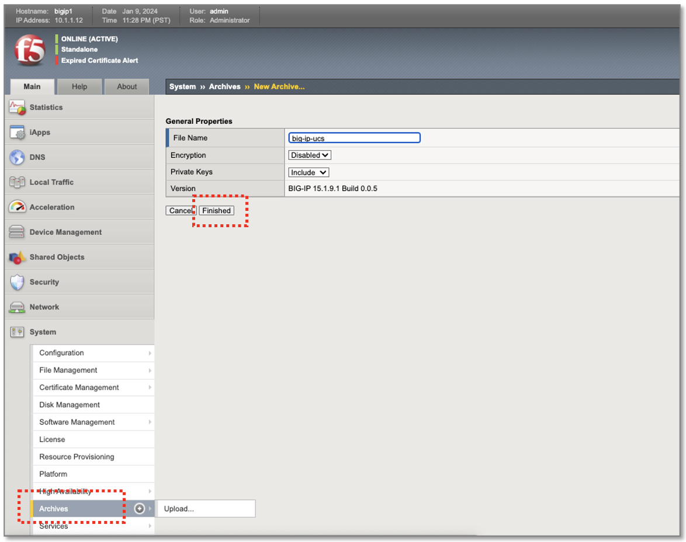
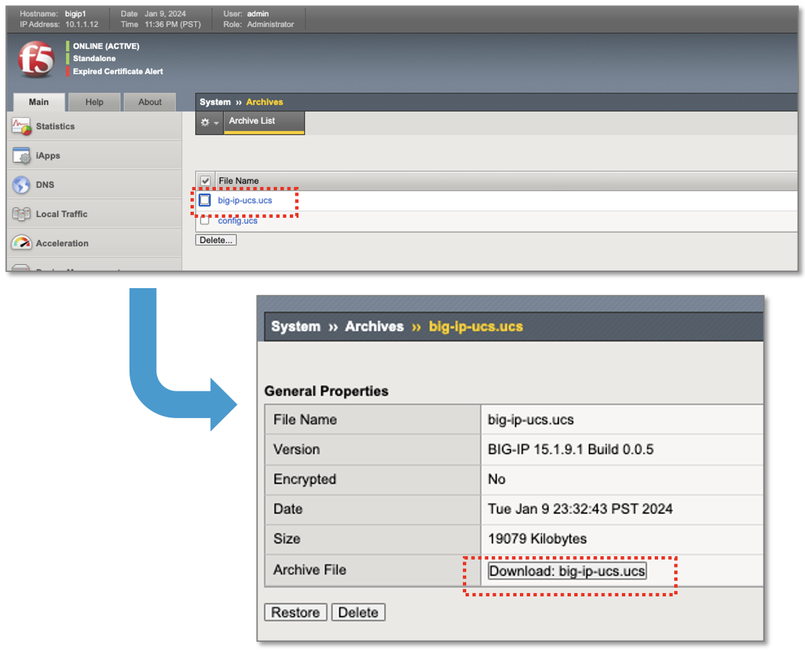

TMOSバックアップファイル(UCS)の準備
======================================

.. note::
   UDFハンズオンラボではUCSファイルは取得済みで準備してありますので、本手順は実施不要です。想定シナリオでの参考情報として掲載しています。

次のNW構成図のように稼働中のClassic BIG-IP(TMOS)が存在し、そこからBIG-IP Next#1へ移行するシナリオを想定しています。

|
多数のVirtual Serverが設定されています。

|
System> Archivesから、"big-ip-ucs"というファイル名でUCSバックアップを作成しています。

|
Archivesリストから作成したUCSファイルをクリックし、DownloadしてローカルPCの任意の場所に保存します。これでUCSファイルの準備は完了です。

