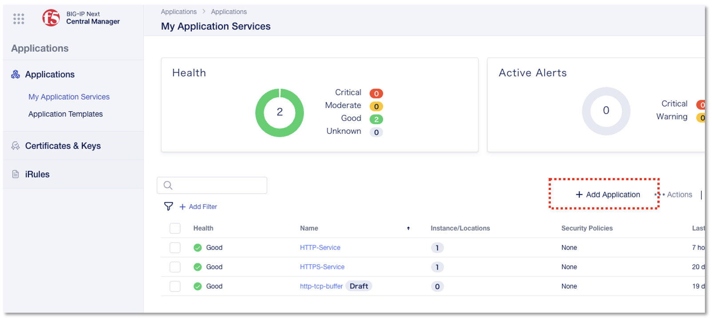
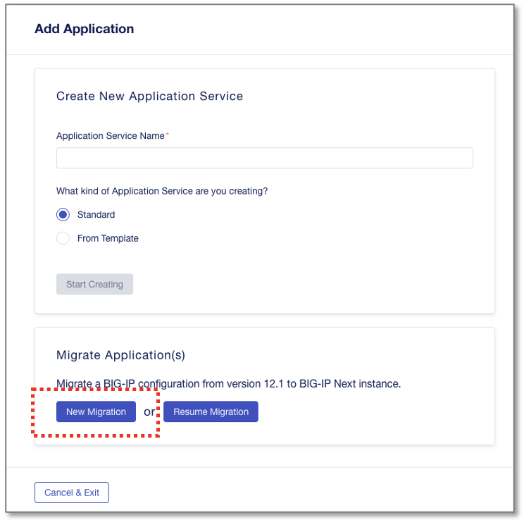
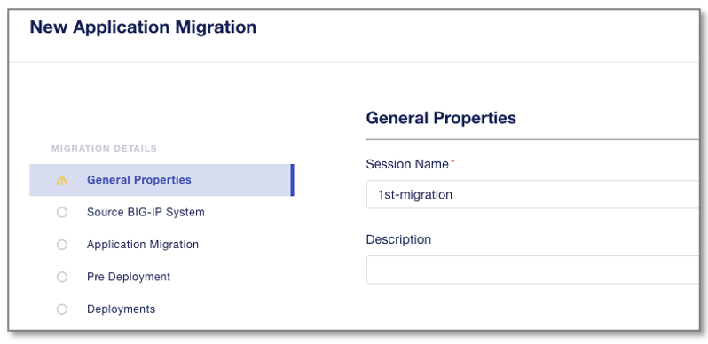
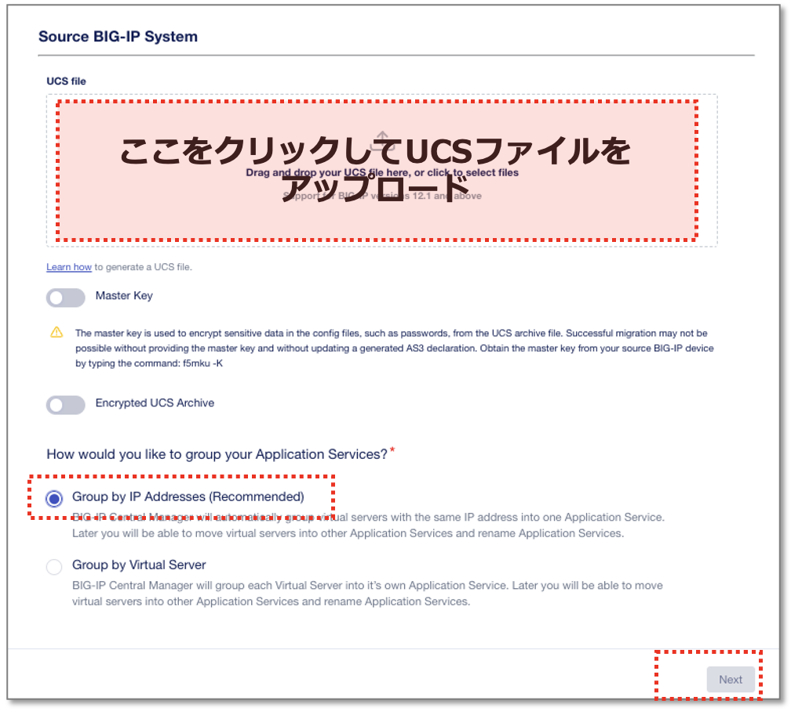
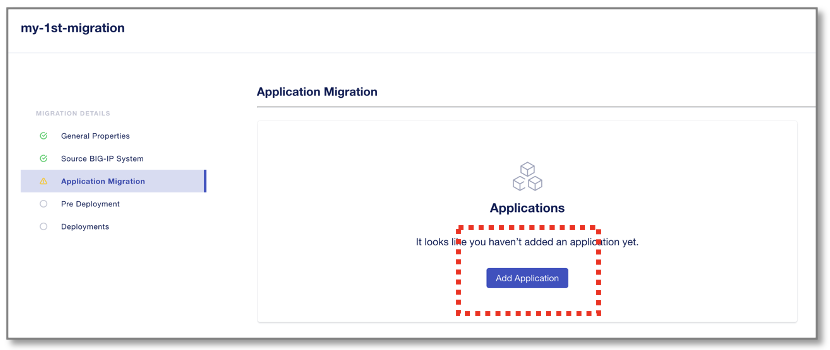
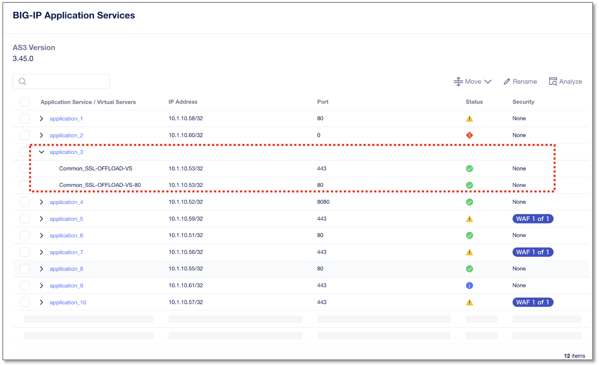
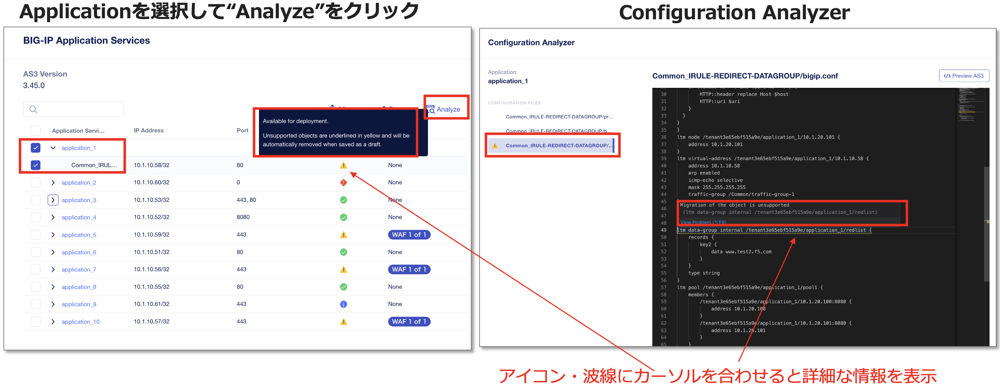

Central ManagerへUCSファイルをインポート
======================================

前ページ手順で取得済みのUCSファイルは、Windows clientのデスクトップ上のフォルダに格納されています。

**デスクトップ > Handson Files > Backup UCS > udf-tmos-bigip.ucs**

.. note::

Windows client上のブラウザからCMへアクセスするか、ファイルを自身のPCへコピーしてから次の手順へ進んでください。

**"Applications"** 画面を開き、
My Application Servicesの画面から **”+ Add Application”** をクリックし、次画面で **”New Migration”** を選択します。

|
General Properties画面で、Migration Session名とDescriptionを設定します。

- Session Name:
   - **my-1st-migration** (任意の名前)
- **"Next"** をクリック

|
CMへアップロードするUCSファイルを選択します。

- 赤枠部分をクリックし、UCSファイルを選択します。
- Master keyをDisable
- **“Group by IP Addresses”** を選択
- **"Next"** をクリック

|
**Add Application** をクリックします。

|
インポートされたApplicationのリストが確認できます。“Group by IP Addresses”を選択したため、同一IPで複数Portのものが同一Applicationにソートされて表示されています。

|
それぞれのアプリケーションの移行可否のアセスメント結果が確認できます。（参考）

.. figure:: images/c10-m2-8.png
   :scale: 40%
   :align: center
