設定マイグレーションの実行
======================================

UCSからインポートしたアプリケーションをNextインスタンスへデプロイします。

|
ステータスがグリーンのApplicationを選択して **"Add"** をクリックします。

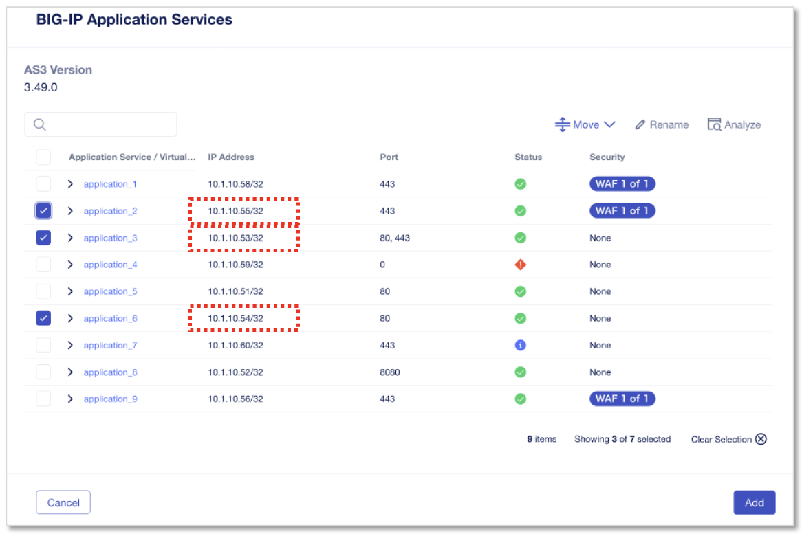

|
**"Next"** をクリックします。

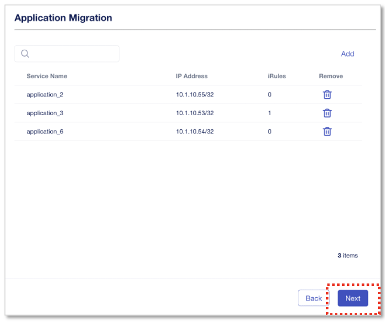

|
“Shared Objects”(iRule、証明書等の共通項目)の **"import"** をすべてクリックしてCMに取り込んだ後、 **”Deploy”** をクリックします。
Deploy Locationは"Save as Draft"のままとしておきます。ここで任意のNextインスタンスを選択することも可能です。

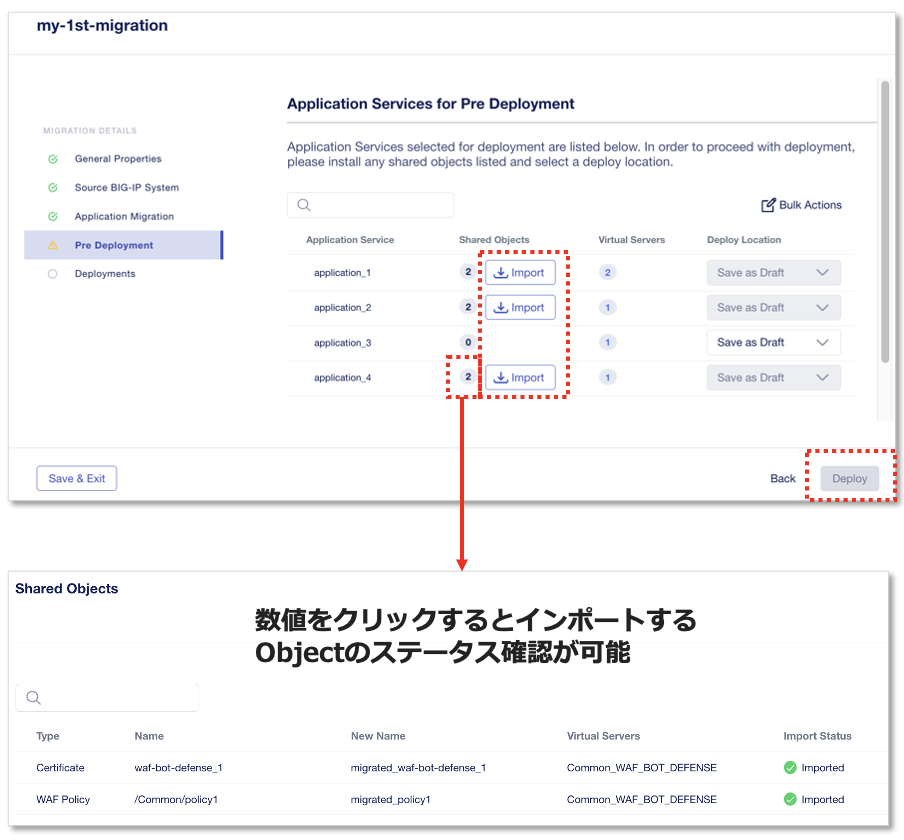

|
正常にSuccessfulでDeployされたら **”Finish”** をクリックして閉じます。

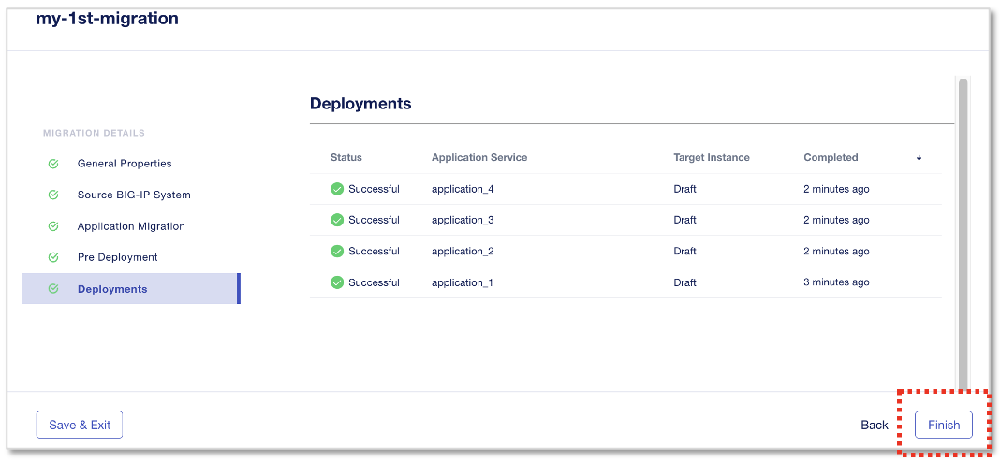

|
My Application Servicesを見ると、Draftとして(instanceへの割り当てなし)Applicationが作成されています。

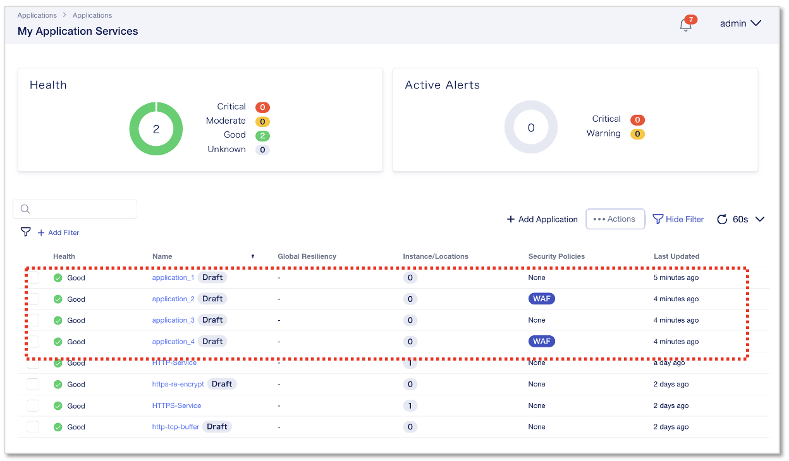

|
（参考）実運用では、通信切り替え前にアドレス重複を避けるために、既存TMOSのVirtual Serverを先にDisableします。

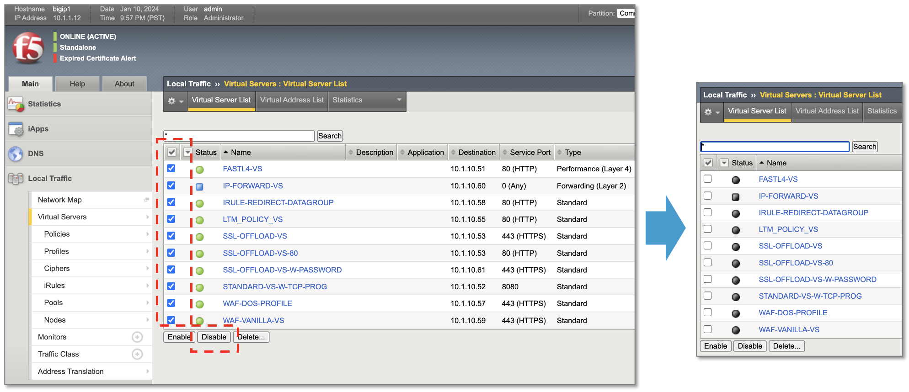

|
DeployするApplication **"application_1"** をクリックします。

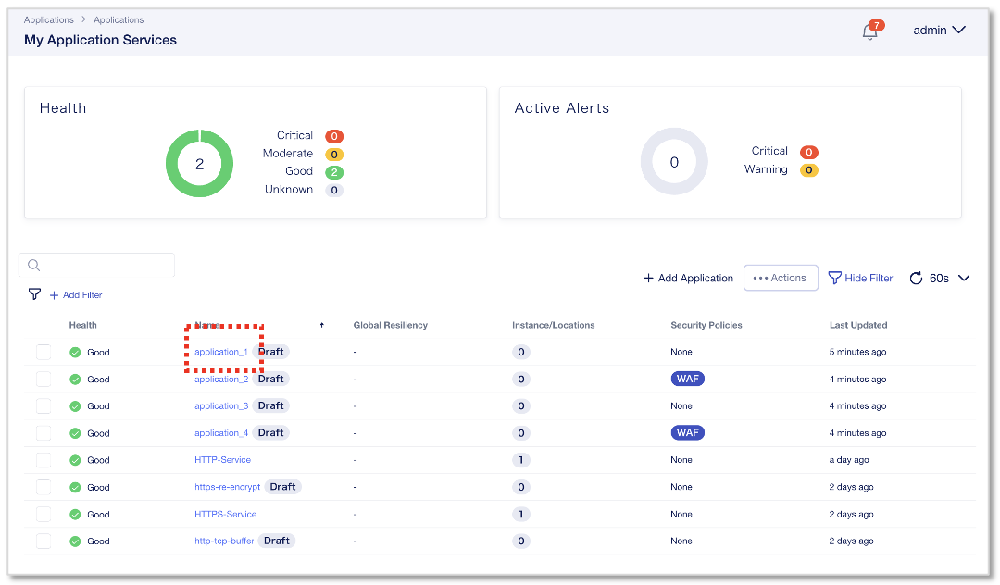

|
**“Review & Deploy”** をクリックします。

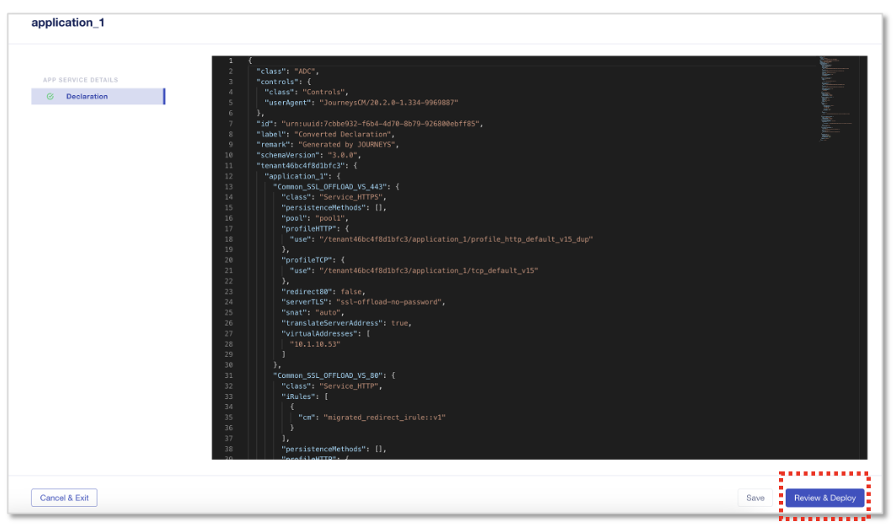

|
アプリケーションをデプロイするNextインスタンスを選択します。 **“Start Adding”** をクリックし、 **big01.f5lab.local** を選択して **"+ Add to List"** をクリックします。

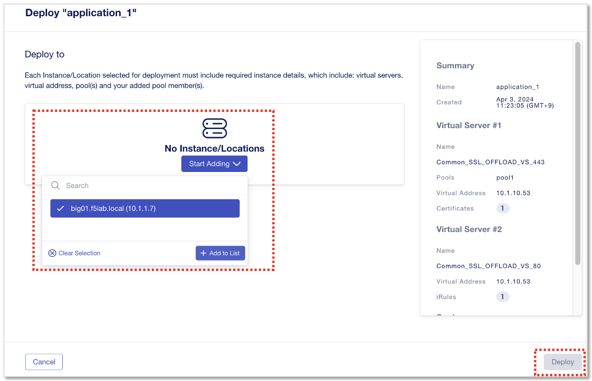

- **"big01.f5lab.local(10.1.1.7)"** を選択
- **"+ Add to List"** をクリック
- **“Deploy”** をクリック

|
Instance/Locationsが "1"と表示されるようになり、1インスタンスにデプロイされていることを示しています。

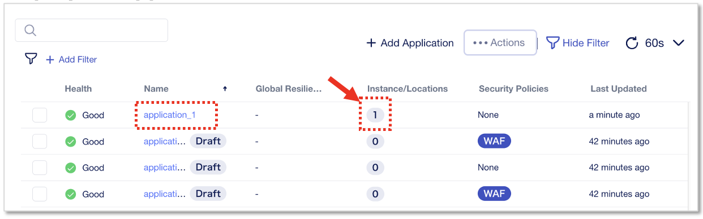

|
デプロイしたApplicationをクリックすると、指定したInstanceで正常に動作していることが確認できます。

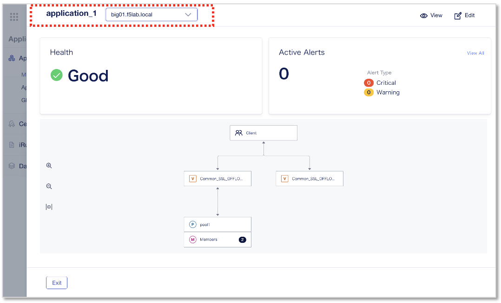

