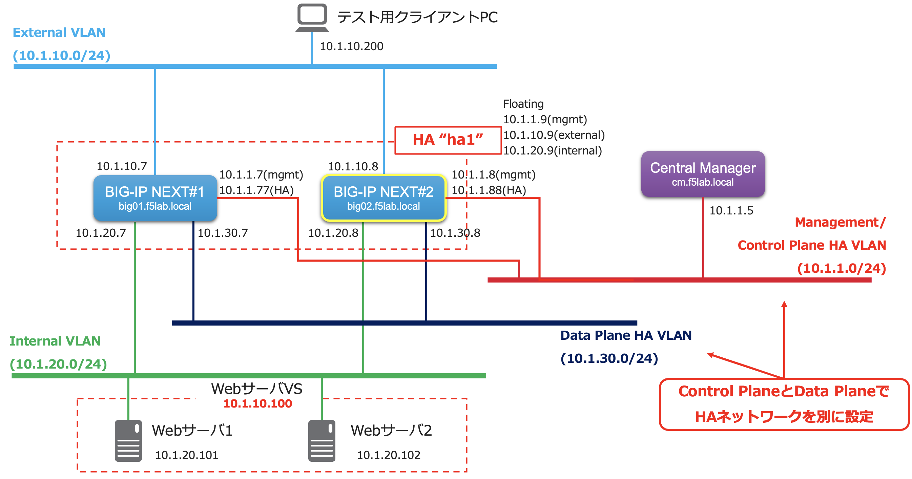

================================================
NextインスタンスのHA冗長構成
================================================

BIG-IP NextインスタンスのHA(High Availability)クラスタを設定していきます。
以下構成図のとおり、BIG-IP Next#2をStandby機として追加します。

.. toctree::
   :titlesonly:
   :caption: 目次:
   :glob:

   module**/module**
