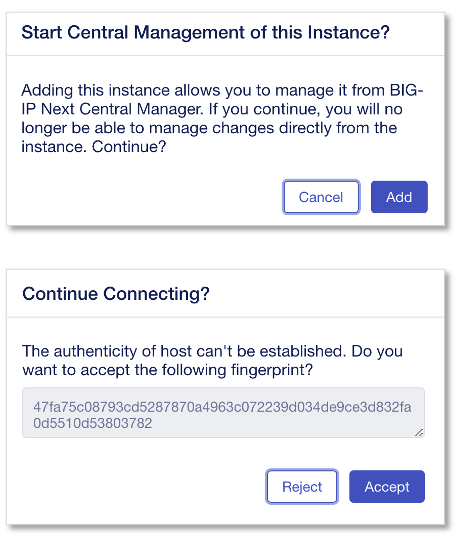

Central Managerへインスタンス#2の登録
======================================

UDF上で”BIG-IP Next instance 2” はすでに起動済みで、interface/vlan/ipのセットアップは４章の手順で実施済みの前提とします。

|
"My Instances"の **"+ Add"** をクリックします。

|
NEXTインスタンス#2のIPアドレスを入力して"Connect"をクリックします。

.. figure:: images/c11-m1-2.png
   :scale: 50%
   :align: center

- IP Address/FQDN:
   - **10.1.1.8**
- **"Connect"** をクリック

|
NEXTインスタンスのCredentialを入力します。

- Username:
   - **admin**
- Password/Confirm Password:
   - **Welcome123!**
- **"Next"** をクリック

|
BIG-IP Next CMからNextインスタンスを管理するためのCredentialを設定し、”Add Instance”クリックします。

- Username:
   - **admin-cm**
- Password:
   - **Welcome123!**
- **"Add Instance"** をクリック

|
確認画面が表れますので、”Add”クリックします。

|
BIG-IP Nextインスタンス#2(10.1.1.8)が追加されたことを確認します。

