HAクラスタのセットアップ
======================================

HAクラスタを設定していきます。

|
スタンバイノードの指定
--------------------------------------

HA Active機とするBIG-IP Nextインスタンス#1(10.1.1.7)のMode “Standalone”をクリックします。

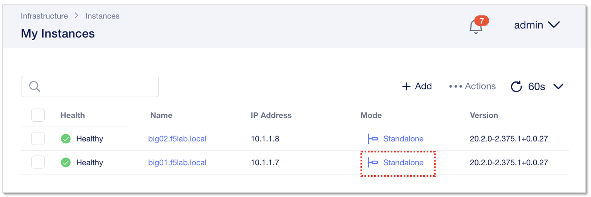

|
左メニューからHAを選択し、 **”Enable HA”** をクリックします。

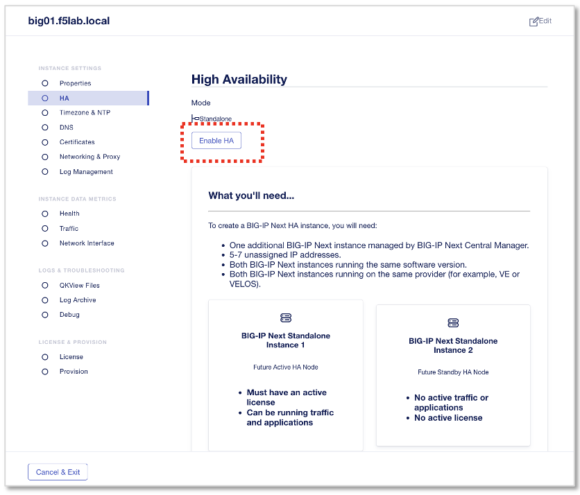

|
ドロップダウンからStandbyノードを選択します。

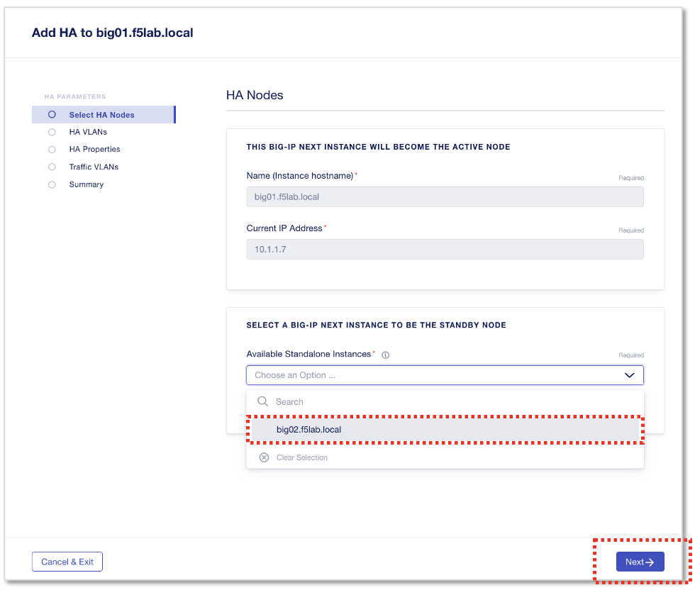

- Available Standalone Instances:
   - **big02.f5lab.local**
- **”Next”** をクリック

|
HA用VLANの設定
--------------------------------------

**HA Control Plane VLAN** を設定します。
Control Plane VLAN新規作成のための **”Create VLAN”** をクリックします。

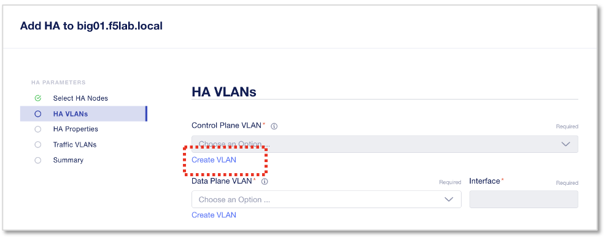

|
VLANの設定情報を入力します。

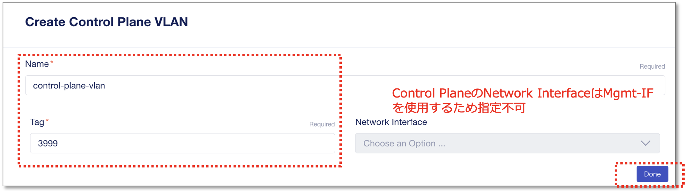

- Name:
   - **control-plane-vlan**
- Tag:
   - **3999**
- **”Done”** をクリック

|
**HA Data Plane VLAN** を設定します。
Data Plane VLAN新規作成のための **”Create VLAN”** をクリックします。

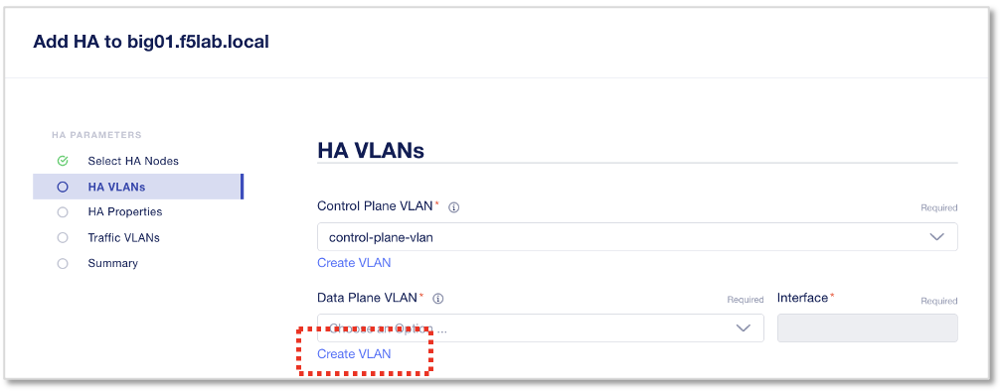

|
VLANの設定情報を入力します。

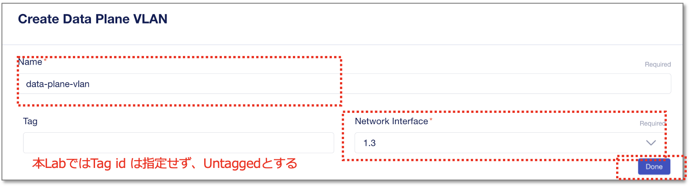

- Name:
   - **data-plane-vlan**
- Network Interface:
   - **1.3**
- **”Done”** をクリック
- 次画面の **”Next”** をクリック

|
HA Propertiesを設定します。

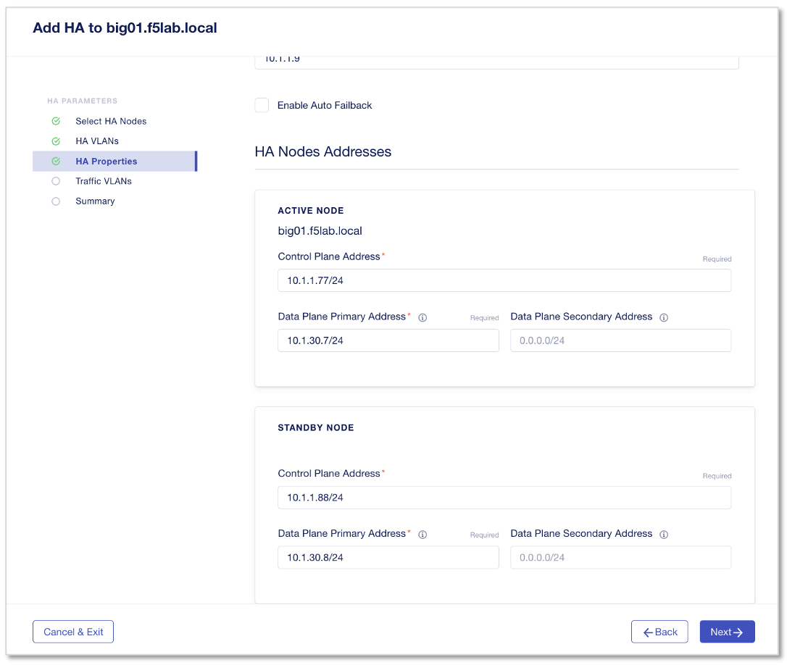

- HA Name:
   - **bigha.f5lab.local**
- HA Management(Floating) IP Address:
   - **10.1.1.9**

*Active Node:*

- Control Plane Address:
   - **10.1.1.77/24**
- Data Plane Primary Address:
   - **10.1.30.7/24**

*Standby Node:*

- Control Plane Address:
   - **10.1.1.88/24**
- Data Plane Primary Address:
   - **10.1.30.8/24**
|
- **”Next”** をクリック

|
HA用Floating IPの設定
--------------------------------------

internal/externalそれぞれのTraffic VLANにfloating ipを追加する設定します。

**"internal-vlan"** をクリックします。

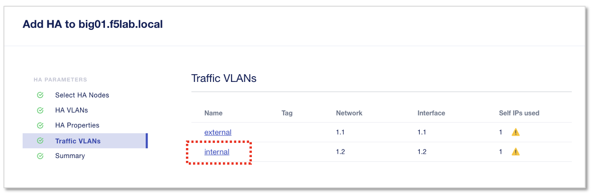

|
“+”をクリックして３行に増やし、Active/Standby/FloatingのIPをそれぞれ設定します。

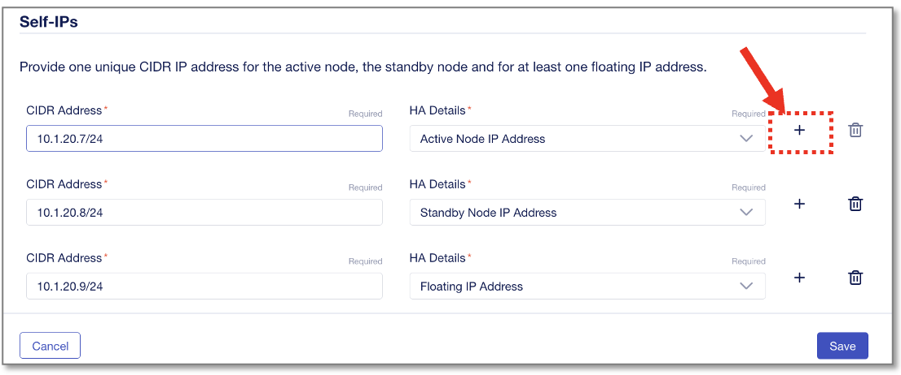

- CIDR Address , HA Details:
   - **10.1.20.7/24 , Active Node IP Address**
   - **10.1.20.8/24 , Standby Node IP Address**
   - **10.1.20.9/24 , Floating IP Address**
- **”Save”** をクリック
- **”Next”** をクリック

|
つづいて、 **"external-vlan"** をクリックします。

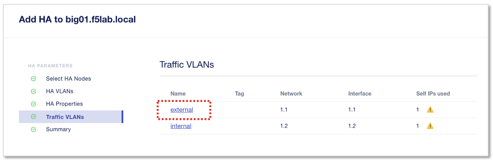

|
“+”をクリックして３行に増やし、Active/Standby/FloatingのIPをそれぞれ設定します。

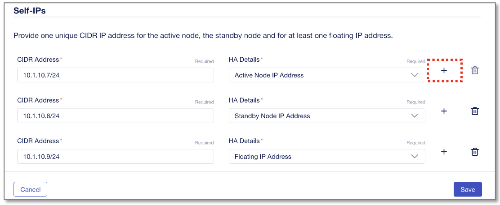

- CIDR Address , HA Details:
   - **10.1.10.7/24 , Active Node IP Address**
   - **10.1.10.8/24 , Standby Node IP Address**
   - **10.1.10.9/24 , Floating IP Address**
- **”Save”** をクリック
- **”Next”** をクリック

|
設定適用と確認
--------------------------------------

サマリー画面を確認し、 **"Deploy to HA"** をクリックし、つづいて表示される **"Yes, Deploy"** をクリックします。

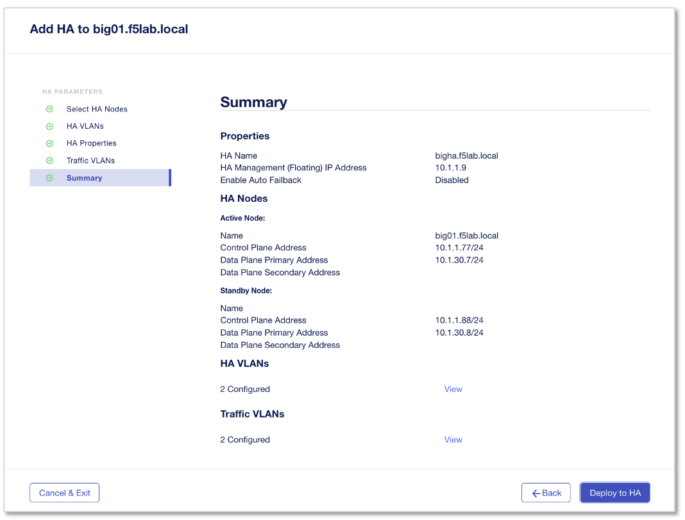

|
デプロイ後、My InstancesのリストにHAクラスタとして表示されます。　ModeのHAをクリックすると、HAの設定状態が確認できます。

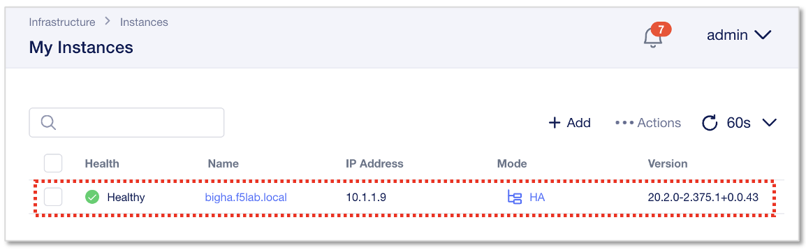

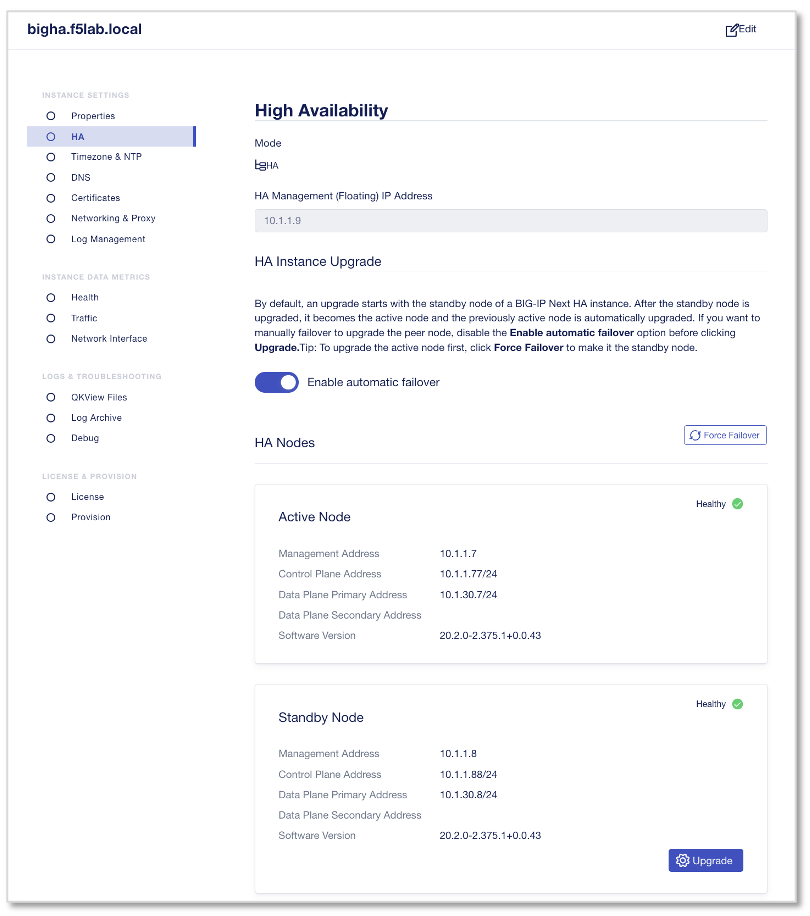
