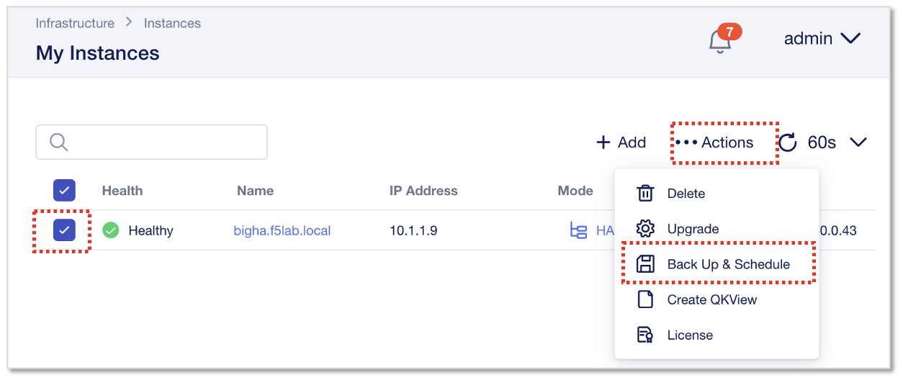
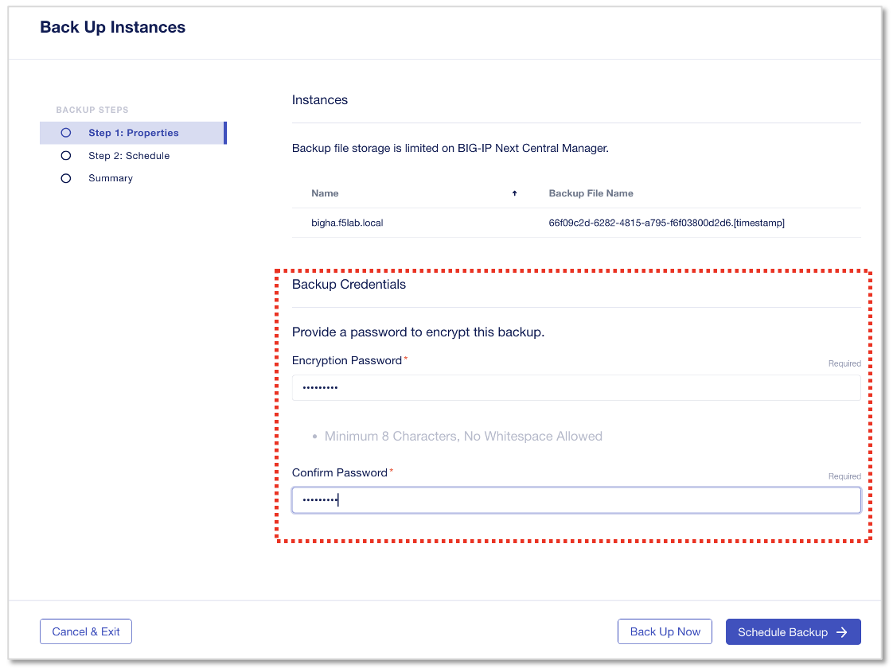
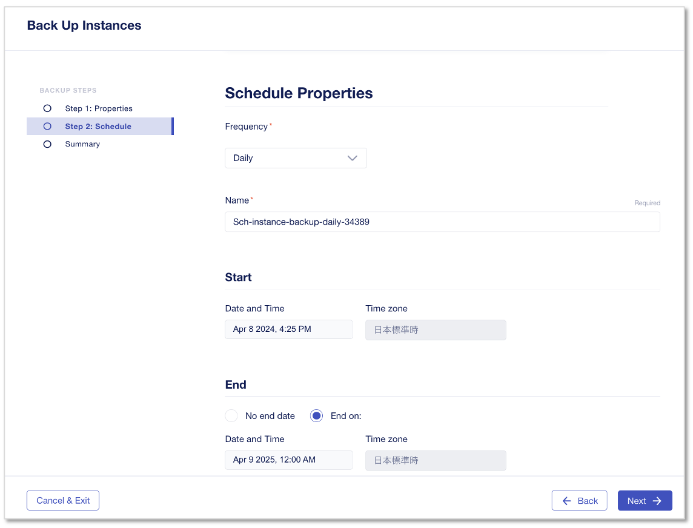
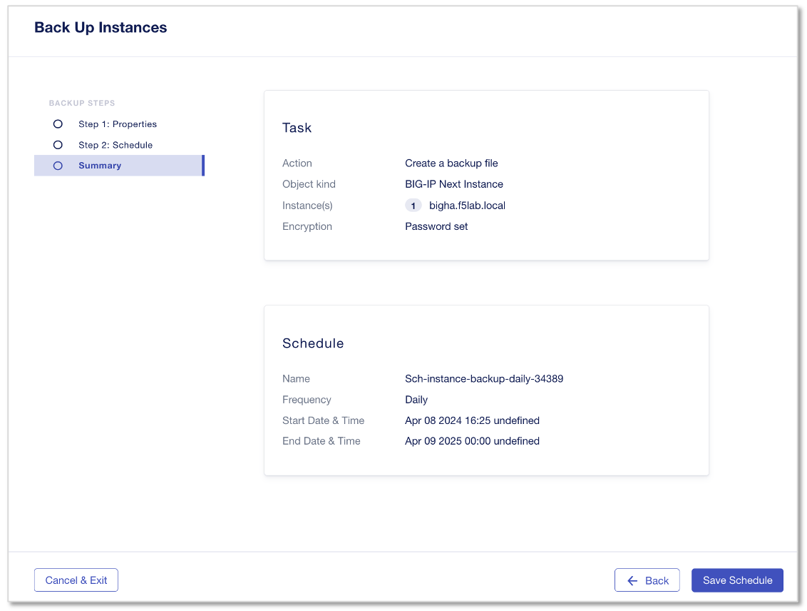
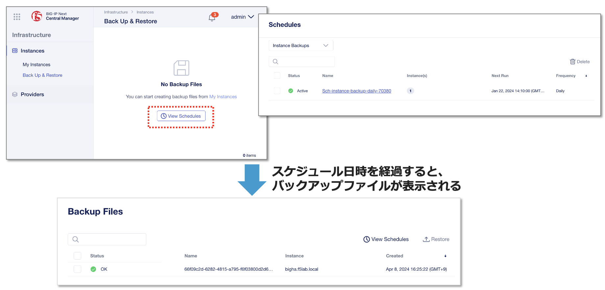

Nextインスタンスのバックアップ
======================================

CMのMy Instances画面から、バックアップするインスタンスを選択し、右上の“Actions”メニューから”Back UP & Schedule”をクリックします。

|
Backup Credentialsで、リストア時に使用するPasswordを設定します。

- Encryption Password/Confirm Password:
   - **backup123**
- **“Schedule Backup →”** をクリック

|
Schedule Propertiesを設定します。今すぐOne timeでバックアップさせるようなオプションが現時点ないため、デイリー（日次実行）でバックアップを取る時刻と、このスケジュールタスクの終了日時の設定をします。

- Frequency:
   - **Daily**
- Start:
   - (現在から5分後くらいの時刻を指定します)
- End:
   - End on: (適当に翌日等に設定します)
- **“Next →”** をクリック

|
サマリー画面を確認して、 **“Save Schedule”** をクリックします。

|
Backup & Restore画面の“View Schedules”をクリックすると、スケジュールされた設定が確認可能です。
スケジュール日時を経過すると、バックアップファイルが作成され表示されます。

