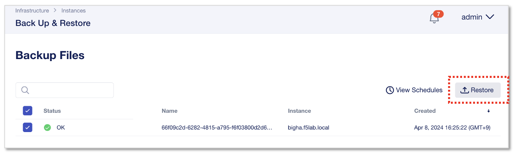
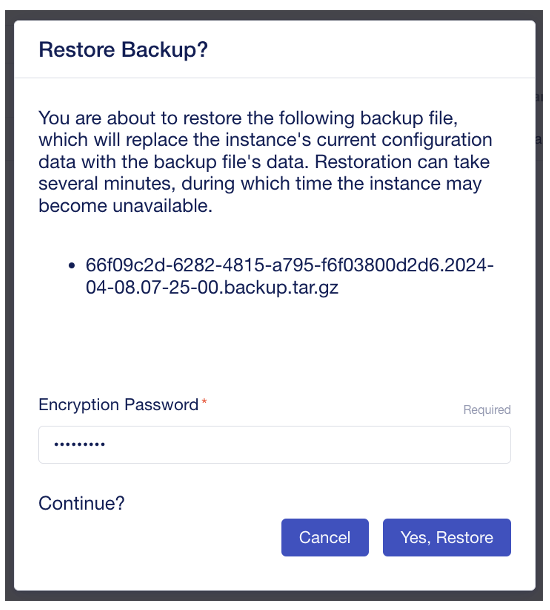
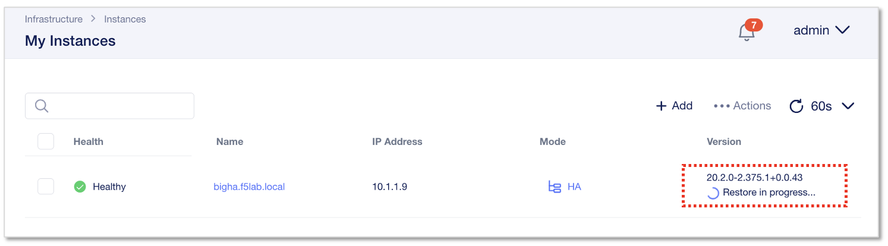

Nextインスタンスのリストア
======================================

Backup & Restore画面から、バックアップするファイルを選択し、右上の **”Restore”** をクリックします。

|
パスワード入力を求められるので、バックアップ作成時に設定したEncryption Passwordを入力し、”Yes, Restore”をクリックします。

- Encryption Password:
   - **backup123**

|
My Instance画面に戻って、インスタンスの状態を確認します。Restore実行中は、完了するまで”Restore in progress”とステータス表示されます。

