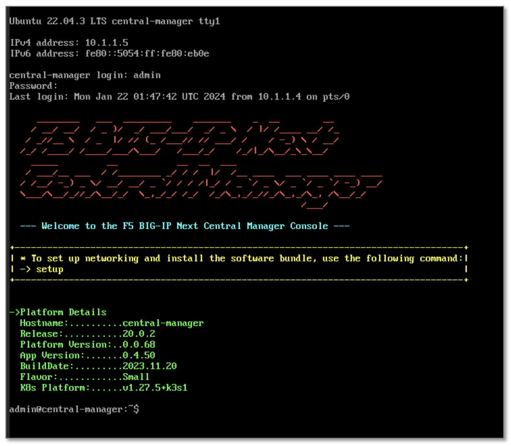
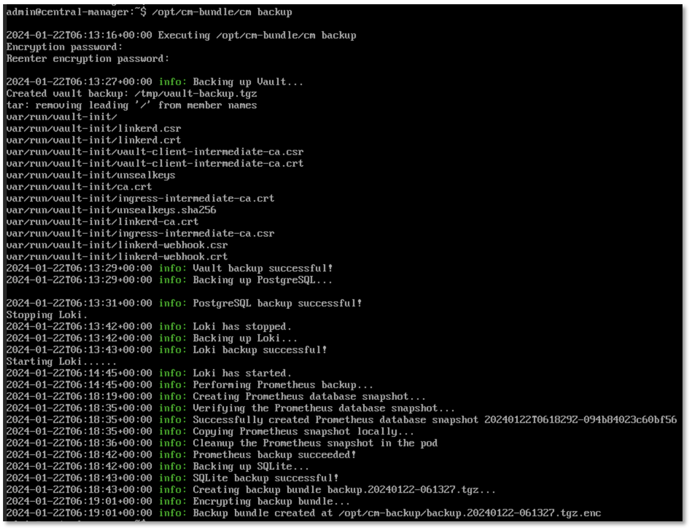

Central Managerのバックアップ
======================================

CLIセッションで作業が必要となるため、UDFのACCESSから"CONSOLE"を選択し、CMへアクセスします。

.. figure:: images/c13-m1-1.png
   :scale: 50%
   :align: center

|
CLIコマンドでBackupを実行します。

.. code-block:: cmdin

 /opt/cm-bundle/cm backup

 Encryption password: backup123
 Reenter encryption password: backup123

|
完了すると以下のようなメッセージが表示され、ファイルが作成されます。

.. code-block:: cmdin

 info: Backup bundle created at /opt/cm-backup/backup.20240122-061327.tgz.enc 
