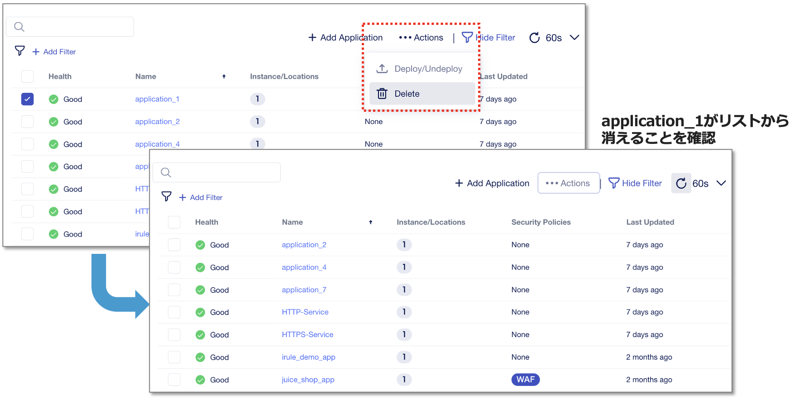

Central Managerのリストア
======================================

バックアップ作成時と同様にCLIセッションで作業が必要となります。
作成されたファイルを、secure location(/opt/cm-backup/)から任意のディレクトリにコピーします。

.. code-block:: cmdin

 例）
 cp /opt/cm-backup/backup.20240122-061327.tgz.enc /home/admin 

.. figure:: images/c13-m2-1.png
   :scale: 50%
   :align: center

|
リストアする前に、CMの設定を変更を試してみます。
My Applicationsから、"application_1"などを適当に削除しておきます。アプリケーションを選択し、右上のActionsから"Delete"をクリックします。

CMからログアウトしてブラウザを閉じます。（オンラインユーザがいると、リストア作業が途中で止まってしまうため）

|
CLIセッションでリストアコマンドを実行し、設定を復元します。

.. code-block:: cmdin

 /opt/cm-bundle/cm restore /home/admin/backup.<バックアップ取得日時>.tgz.enc 

リストア完了のメッセージを確認します。

.. code-block:: cmdin

 info: Restore completed successfully.

|
再度CMにログインして、CMのMy Applicationsのリストに削除したアプリケーションが復元されていることを確認します。
リストアが完了するまで数分かかります。

