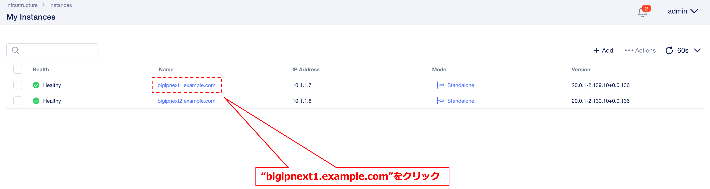
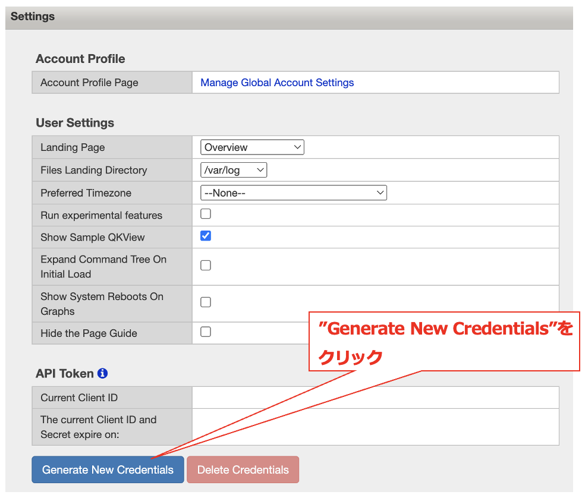
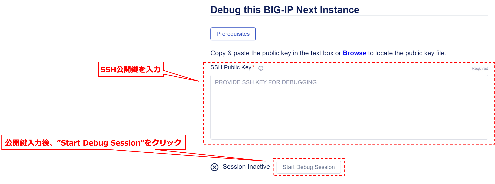
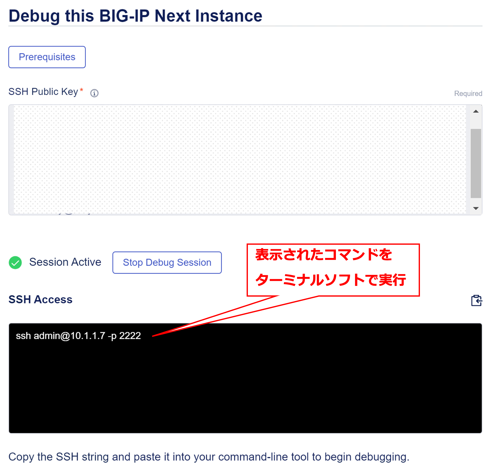
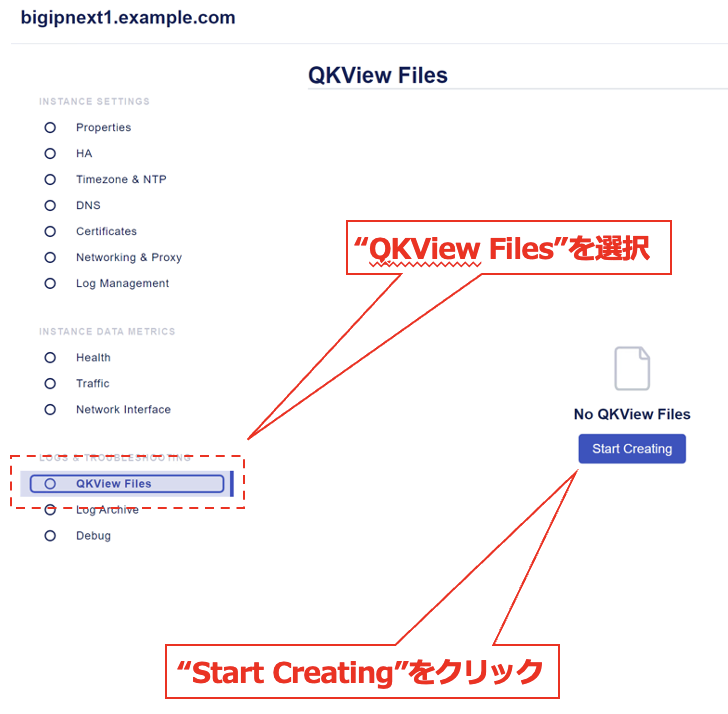
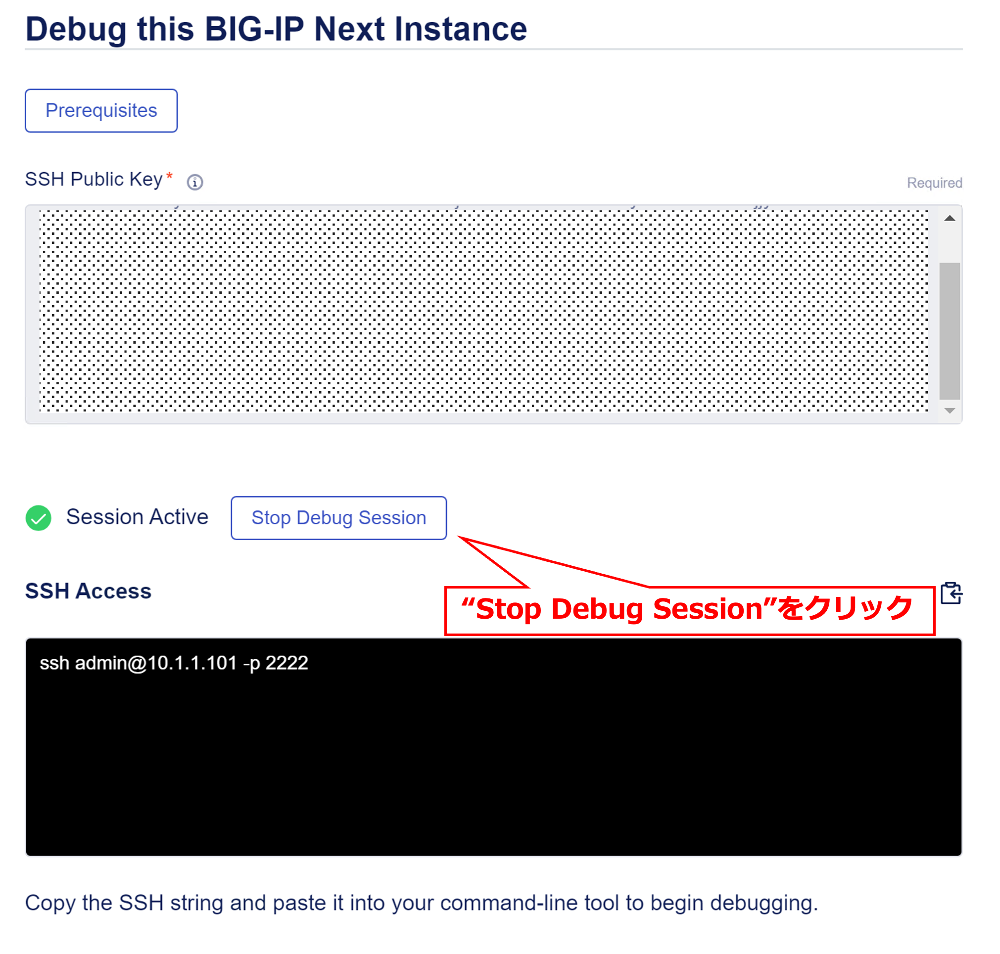
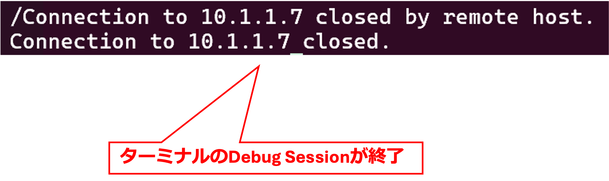

デバッグ・ユーティリティの利用方法
======================================

デバッグ・ユーティリティは、以下の方法で利用可能です。

クライアントでSSH公開鍵を作成
--------------------------------------

クライアント端末で、SSH公開鍵を取得もしくは作成します (例: ~/.ssh/id_rsa.pub)。各OSにおける詳細な手順につきましては、以下のドキュメントをご参照ください。

https://clouddocs.f5.com/bigip-next/latest/support/debug_utility.html#retrieve-client-ssh-public-key

.. note::
   F5 UDFラボのWindows 10 ClientにはSSH公開鍵には含まれていないため、上記ドキュメントの手順に従って、ssh-keygenコマンドでSSH公開鍵を生成してください。

BIG-IP Central Managerでデバッグ・セッションを設定
--------------------------------------

My instancesから、デバッグ・セッションを行うBIG-IP Nextインスタンスを選択します。

|
“Debug”を選択し、“Proceed”をクリックします。

|
クライアント端末で作成したSSH公開鍵をコピーして、"Start Debug Session"をクリックします。

|
Central Manager GUIに表示されたSSHコマンドを、ターミナルソフトで実行します。

|
NextインスタンスにSSH接続できることを確認します。

|
デバッグ・セッションの終了
--------------------------------------

Central Manager GUIで、"Stop Debug Session"をクリックします。

|
ターミナルのセッションが終了したことを確認します。

|
