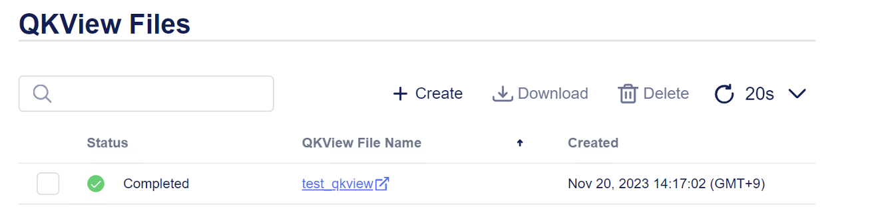
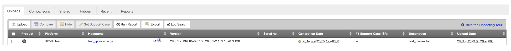

QKViewの取得
======================================

事前準備：Client IDとSecretの取得(iHealth)
--------------------------------------

iHealthサイトから、ユーザのClient IDとSecretを入手する必要があります。

`iHealth <https://ihealth.f5.com/>`_ にログインし、右上の”Settings”をクリックします。

.. figure:: images/c14-m1-1.png
   :scale: 50%
   :align: center

|
”Generate New Credentials”をクリックします。

.. figure:: images/c14-m1-2.png
   :scale: 50%
   :align: center

|
生成されたClient IDとClient Secretをコピーします。

.. figure:: images/c14-m1-3.png
   :scale: 50%
   :align: center

|
QKView取得の設定
--------------------------------------

My instancesから、Qkviewを取得するBIG-IP Nextインスタンスを選択します。

.. figure:: images/c14-m1-4.png
   :scale: 40%
   :align: center

|
“QKView Files”を選択し、“Start Creating”をクリックします。

.. figure:: images/c14-m1-5.png
   :scale: 50%
   :align: center

|
iHealthで生成したClient IDおよびSecretを入力し、Submitをクリックします。

.. figure:: images/c14-m1-6.png
   :scale: 50%
   :align: center

|
QKViewファイル名を入力後、”Generate”をクリックします。

.. figure:: images/c14-m1-7.png
   :scale: 50%
   :align: center

|
QKView生成のプロセスが”Initiated” → “Generating” → “Uploading”と遷移した後、最終的に”Completed”になることを確認します。

|
iHealthで確認
--------------------------------------

iHealthにログインし、Qkviewファイルがアップロードされていることを確認します。

